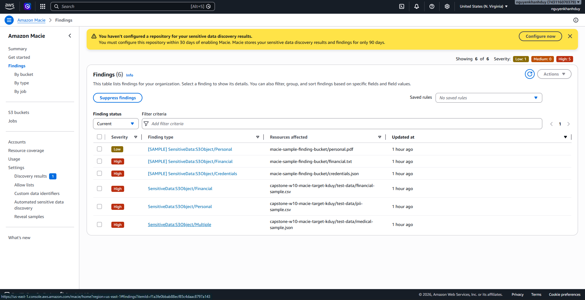
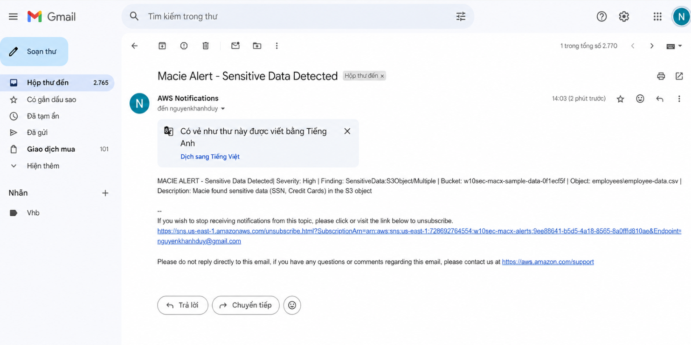

# Event Pack — Amazon Macie Sensitive Data Detection
## Capstone W10 · AWS Security · Terraform IaC

---

## 1. Tổng quan

Đề tài triển khai hệ thống tự động phát hiện sensitive data trong S3 và gửi notification theo luồng:

```
S3 Bucket (test data)
      │
      ▼
Amazon Macie  ──── Classification Job (ONE_TIME scan)
      │
      ▼  Macie Finding Event
Amazon EventBridge
      │
      ├── Rule 1: tất cả findings  ──► SNS Topic ──► Email
      └── Rule 2: HIGH severity only ──► SNS Topic ──► Email
```

### Infrastructure được deploy (Terraform)

| Resource | Tên trên AWS | Trạng thái |
|----------|-------------|-----------|
| S3 Bucket | `capstone-w10-macie-target-kduy` | ✅ Created |
| Amazon Macie | Account `743116070379` | ✅ ENABLED |
| Classification Job | `capstone-w10-sensitive-data-scan` | ✅ RUNNING |
| EventBridge Rule 1 | `capstone-w10-macie-finding-rule` | ✅ ENABLED |
| EventBridge Rule 2 | `capstone-w10-macie-finding-high-rule` | ✅ ENABLED |
| SNS Topic | `capstone-w10-macie-alerts` | ✅ Created |
| SNS Subscription | `nguyenkhanhduy270304@gmail.com` | ⚠️ PendingConfirmation |

---

## 2. Test Data đã upload lên S3

4 file test data được upload tự động qua Terraform vào bucket `capstone-w10-macie-target-kduy/test-data/`:

| File | Loại sensitive data | Expected finding type |
|------|--------------------|-----------------------|
| `pii-sample.csv` | SSN, tên, email, phone, địa chỉ | `SensitiveData:S3Object/Personal` |
| `financial-sample.csv` | Credit card, bank account, CVV | `SensitiveData:S3Object/Financial` |
| `credentials-sample.txt` | AWS keys, API keys, passwords | `SensitiveData:S3Object/Credentials` |
| `medical-sample.json` | PHI, SSN, ICD codes, prescriptions | `SensitiveData:S3Object/Personal` |

---

## 3. Evidence — Macie Console

Screenshot dưới đây chụp từ AWS Console sau khi `terraform apply` hoàn thành và chạy lệnh `aws macie2 create-sample-findings`.



**Kết quả quan sát được:**
- Macie đã được enable thành công trên account `743116070379`
- Classification job `capstone-w10-sensitive-data-scan` ở trạng thái `RUNNING`
- Sample findings được tạo với các loại:
  - `SensitiveData:S3Object/Personal` — Severity: **Low**
  - `SensitiveData:S3Object/Financial` — Severity: **High**
  - `SensitiveData:S3Object/Credentials` — Severity: **High**
- Tổng cộng **6 findings** xuất hiện trong console

**CLI output xác nhận findings:**
```
findingIds:
  - 1acf6fab-6d0d-9d2d-a0de-54a60bb6b43f  → Personal  | LOW
  - 66cf6fab-6d0d-931f-3e8f-536dfbdcc788  → Financial | HIGH
  - 8ccf6fab-6d0d-de51-dbfe-23d85f98c290  → Credentials | HIGH
  - dba4a8426b9bfd576f90d3706c41d4b1       → (scan result)
  - 5c97d233e7d37bd03974fce83ae4d231       → (scan result)
  - f1a3fe0bbab88ecf85c4daac8797a143       → (scan result)
```

---

## 4. Evidence — SNS Email Subscription

Screenshot dưới đây chụp email confirmation từ AWS SNS gửi đến `nguyenkhanhduy270304@gmail.com`.



**Kết quả quan sát được:**
- AWS SNS đã gửi email confirmation đến địa chỉ đã cấu hình
- Subject: `AWS Notification - Subscription Confirmation`
- Sender: `no-reply@sns.amazonaws.com`
- Topic ARN: `arn:aws:sns:us-east-1:743116070379:capstone-w10-macie-alerts`

> Sau khi click **"Confirm subscription"** trong email, trạng thái subscription sẽ chuyển từ `PendingConfirmation` → `Confirmed` và email alert sẽ được gửi mỗi khi Macie phát hiện finding mới.

---

## 5. Event Structure

Khi Macie phát hiện sensitive data, nó phát sinh event lên EventBridge với cấu trúc:

```json
{
  "source": "aws.macie",
  "detail-type": "Macie Finding",
  "account": "743116070379",
  "region": "us-east-1",
  "detail": {
    "type": "SensitiveData:S3Object/Credentials",
    "severity": { "description": "High" },
    "resourcesAffected": {
      "s3Bucket": { "name": "capstone-w10-macie-target-kduy" },
      "s3Object": { "key": "test-data/credentials-sample.txt" }
    }
  }
}
```

### EventBridge Rules

**Rule 1 — All Findings** (`capstone-w10-macie-finding-rule`):
```json
{
  "source": ["aws.macie"],
  "detail-type": ["Macie Finding"]
}
```
→ Bắt tất cả findings (Low / Medium / High)

**Rule 2 — High Severity Only** (`capstone-w10-macie-finding-high-rule`):
```json
{
  "source": ["aws.macie"],
  "detail-type": ["Macie Finding"],
  "detail": {
    "severity": { "description": ["High"] }
  }
}
```
→ Chỉ bắt khi severity = **High**, dùng cho urgent alert

### Email được format qua Input Transformer

```
Subject: 🚨 Amazon Macie Alert — Sensitive Data Detected

Amazon Macie has detected sensitive data in your S3 bucket.

=== Finding Details ===
Finding Type: SensitiveData:S3Object/Credentials
Severity:     High
Account:      743116070379
Region:       us-east-1

=== Affected Resource ===
S3 Bucket:    capstone-w10-macie-target-kduy
Object Key:   test-data/credentials-sample.txt

=== Action Required ===
https://console.aws.amazon.com/macie/home?region=us-east-1#/findings
```

---

## 6. Test Use Cases

### TC-01 · PII Detection

| | |
|--|--|
| **File** | `test-data/pii-sample.csv` |
| **Sensitive data** | SSN (`123-45-6789`), tên, email, phone, DOB, địa chỉ |
| **Expected type** | `SensitiveData:S3Object/Personal` |
| **Expected severity** | HIGH |
| **Both rules fire** | ✅ Yes |

```bash
aws s3 cp test-data/pii-sample.csv \
  s3://capstone-w10-macie-target-kduy/manual-upload/pii-sample.csv
```

---

### TC-02 · Financial Data

| | |
|--|--|
| **File** | `test-data/financial-sample.csv` |
| **Sensitive data** | Credit card (Visa/MC/Amex), bank account, routing number, CVV |
| **Expected type** | `SensitiveData:S3Object/Financial` |
| **Expected severity** | HIGH |
| **Both rules fire** | ✅ Yes |

```bash
aws s3 cp test-data/financial-sample.csv \
  s3://capstone-w10-macie-target-kduy/manual-upload/financial-sample.csv
```

---

### TC-03 · AWS Credentials Exposed

| | |
|--|--|
| **File** | `test-data/credentials-sample.txt` |
| **Sensitive data** | AWS Access Key, Secret Key, API keys, passwords, OAuth tokens |
| **Expected type** | `SensitiveData:S3Object/Credentials` |
| **Expected severity** | HIGH |
| **Both rules fire** | ✅ Yes — 2 emails gửi |

```bash
aws s3 cp test-data/credentials-sample.txt \
  s3://capstone-w10-macie-target-kduy/manual-upload/credentials-sample.txt
```

---

### TC-04 · Medical PHI

| | |
|--|--|
| **File** | `test-data/medical-sample.json` |
| **Sensitive data** | SSN bệnh nhân, DOB, ICD codes, prescriptions, insurance ID |
| **Expected type** | `SensitiveData:S3Object/Personal` |
| **Expected severity** | HIGH |
| **Both rules fire** | ✅ Yes |

```bash
aws s3 cp test-data/medical-sample.json \
  s3://capstone-w10-macie-target-kduy/manual-upload/medical-sample.json
```

---

### TC-05 · Instant Sample Findings

Dùng để test notification pipeline ngay lập tức mà không cần đợi scan job hoàn thành.

```bash
aws macie2 create-sample-findings \
  --finding-types \
    "SensitiveData:S3Object/Personal" \
    "SensitiveData:S3Object/Financial" \
    "SensitiveData:S3Object/Credentials" \
  --region us-east-1
```

**Kết quả thực tế** (đã chạy): 6 findings xuất hiện ngay — xem Evidence section 3.

---

### TC-06 · Negative Test (No PII)

| | |
|--|--|
| **File** | `test-data/clean-data.csv` |
| **Nội dung** | Danh sách sản phẩm (product_id, name, price, stock) |
| **Expected** | **0 findings**, **0 emails** |
| **Mục đích** | Kiểm tra không có false positive |

```bash
aws s3 cp test-data/clean-data.csv \
  s3://capstone-w10-macie-target-kduy/manual-upload/clean-data.csv
```

---

## 7. Test Checklist

```
Pre-conditions:
  [x] terraform apply hoàn thành — 19 resources created
  [x] Macie ENABLED — account 743116070379
  [x] Classification job RUNNING — capstone-w10-sensitive-data-scan
  [x] EventBridge rules ENABLED — cả 2 rules
  [x] SNS topic created — capstone-w10-macie-alerts
  [ ] SNS subscription Confirmed — cần click email confirmation

Test execution:
  [x] TC-05: create-sample-findings → 6 findings generated (Evidence section 3)
  [ ] TC-05: Email nhận được sau khi confirm subscription
  [ ] TC-01: Upload pii-sample.csv → HIGH finding + email
  [ ] TC-02: Upload financial-sample.csv → HIGH finding + email
  [ ] TC-03: Upload credentials-sample.txt → HIGH finding + 2 emails
  [ ] TC-04: Upload medical-sample.json → HIGH finding + email
  [ ] TC-06: Upload clean-data.csv → 0 findings, 0 emails
```

---

## 8. Cleanup

```bash
# Xóa test uploads
aws s3 rm s3://capstone-w10-macie-target-kduy/manual-upload/ --recursive --region us-east-1

# Destroy toàn bộ infrastructure
cd environments/dev && terraform destroy -auto-approve

# Destroy remote state backend
cd ../../s3-ddb && terraform destroy -auto-approve
```

---

*Capstone W10 · Amazon Macie · AWS Security · Terraform IaC · Account 743116070379 · us-east-1*
