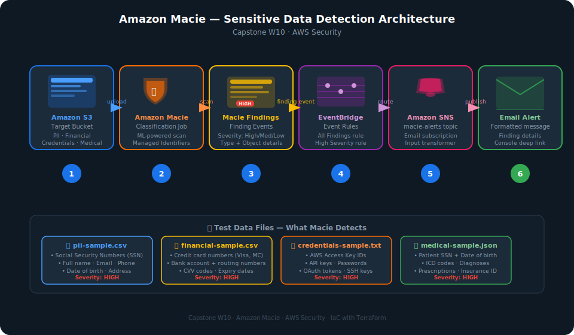
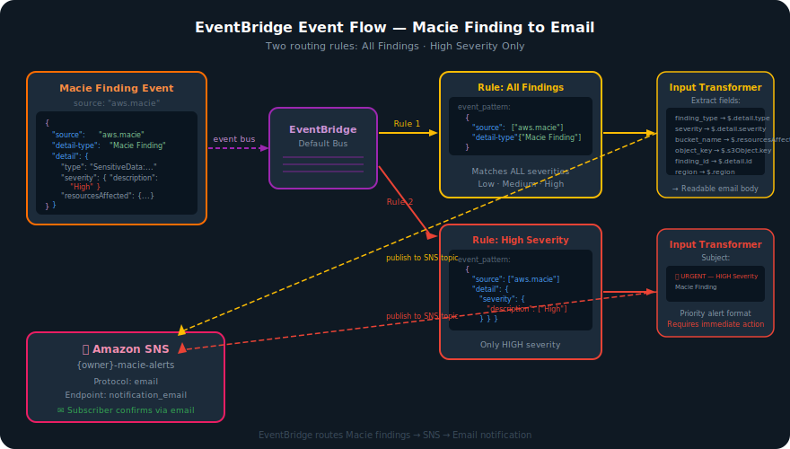
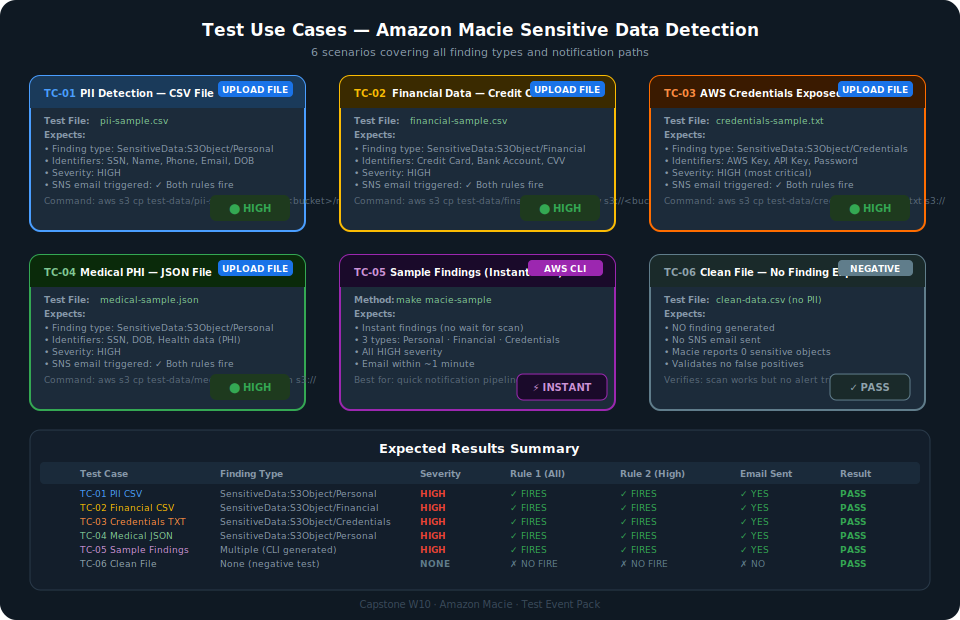
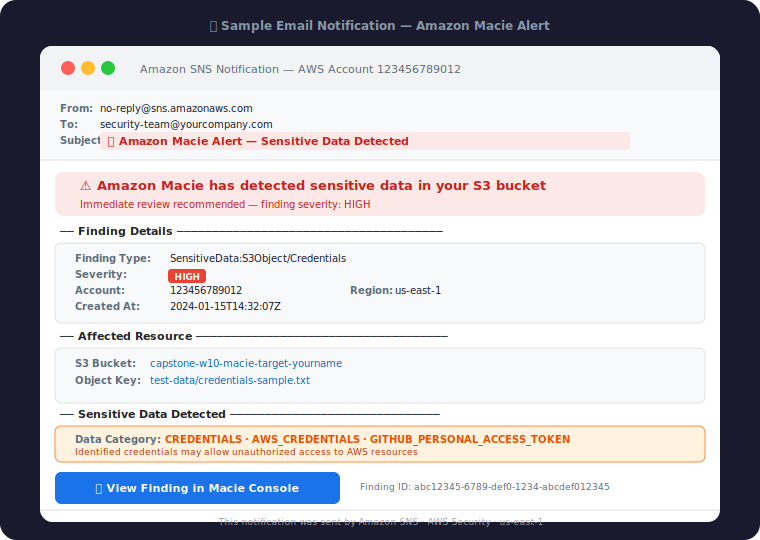

# Event Pack — Amazon Macie Sensitive Data Detection
## Capstone W10 · AWS Security · Test Use Cases

---

## Architecture



---

## EventBridge Flow



---

## 1. Event Structure

Khi Macie phát hiện sensitive data, nó publish một **Macie Finding Event** lên EventBridge.
File mẫu: [`test-data/sample-finding-event.json`](../test-data/sample-finding-event.json)

```json
{
  "source": "aws.macie",
  "detail-type": "Macie Finding",
  "detail": {
    "type": "SensitiveData:S3Object/Credentials",
    "severity": { "description": "High" },
    "resourcesAffected": {
      "s3Bucket": { "name": "capstone-w10-macie-target-yourname" },
      "s3Object": { "key": "test-data/credentials-sample.txt" }
    }
  }
}
```

### EventBridge Rules được deploy

| Rule Name | Pattern | Trigger khi |
|-----------|---------|------------|
| `{owner}-macie-finding-rule` | `source: aws.macie` + `detail-type: Macie Finding` | **Tất cả** findings (Low/Med/High) |
| `{owner}-macie-finding-high-rule` | Thêm filter `severity.description: ["High"]` | Chỉ **HIGH** severity |

---

## 2. Test Use Cases



---

### TC-01 · PII Detection — CSV File

**Mô tả:** Upload file CSV chứa Personal Identifiable Information (SSN, tên, email, số điện thoại).

**File test:** `test-data/pii-sample.csv`

**Dữ liệu nhạy cảm trong file:**
- Social Security Numbers (dạng `123-45-6789`)
- Họ tên đầy đủ + ngày sinh
- Email + số điện thoại + địa chỉ

**Cách chạy:**
```bash
# Upload file mới vào bucket (trigger scan)
aws s3 cp test-data/pii-sample.csv \
  s3://$(terraform -chdir=environments/dev output -raw target_bucket_name)/manual-upload/pii-sample.csv \
  --region us-east-1

# Hoặc trigger bằng make
make macie-sample
```

**Expected Finding:**
```
Type:       SensitiveData:S3Object/Personal
Severity:   HIGH
Category:   PERSONAL_INFORMATION
Identifiers: NAME, ADDRESS, EMAIL_ADDRESS, PHONE_NUMBER, USA_SOCIAL_SECURITY_NUMBER
```

**Expected Email Subject:**
```
🚨 Amazon Macie Alert — Sensitive Data Detected
```

**Pass Criteria:** ✅ Finding xuất hiện trong Macie console + Email nhận được

---

### TC-02 · Financial Data — Credit Card Numbers

**Mô tả:** Upload file CSV chứa thông tin thẻ tín dụng và tài khoản ngân hàng.

**File test:** `test-data/financial-sample.csv`

**Dữ liệu nhạy cảm trong file:**
- Credit card numbers (Visa, Mastercard, Amex, Discover)
- Bank account + routing numbers
- CVV codes + expiry dates

**Cách chạy:**
```bash
aws s3 cp test-data/financial-sample.csv \
  s3://$(terraform -chdir=environments/dev output -raw target_bucket_name)/manual-upload/financial-sample.csv \
  --region us-east-1
```

**Expected Finding:**
```
Type:       SensitiveData:S3Object/Financial
Severity:   HIGH
Category:   FINANCIAL_INFORMATION
Identifiers: CREDIT_CARD_NUMBER, CREDIT_CARD_EXPIRY, USA_BANK_ACCOUNT_NUMBER
```

**Pass Criteria:** ✅ Finding xuất hiện + Email nhận được với subject "🚨 Amazon Macie Alert"

---

### TC-03 · AWS Credentials & API Keys Exposed

**Mô tả:** Upload file TXT chứa AWS access keys, API tokens, passwords.  
Đây là loại finding **nguy hiểm nhất** — credentials có thể bị dùng để compromise AWS account.

**File test:** `test-data/credentials-sample.txt`

**Dữ liệu nhạy cảm trong file:**
- AWS Access Key ID + Secret Access Key
- Stripe, SendGrid, Twilio API keys
- GitHub OAuth client secrets
- Database passwords + JWT secrets

**Cách chạy:**
```bash
aws s3 cp test-data/credentials-sample.txt \
  s3://$(terraform -chdir=environments/dev output -raw target_bucket_name)/manual-upload/credentials-sample.txt \
  --region us-east-1
```

**Expected Finding:**
```
Type:       SensitiveData:S3Object/Credentials
Severity:   HIGH
Category:   CREDENTIALS
Identifiers: AWS_CREDENTIALS, GITHUB_PERSONAL_ACCESS_TOKEN, API_KEY
```

**Pass Criteria:** ✅ Finding HIGH + **cả 2 EventBridge rules đều fire** + 2 emails nhận được

---

### TC-04 · Medical PHI — JSON File

**Mô tả:** Upload file JSON chứa Protected Health Information (PHI) — dữ liệu bệnh nhân.

**File test:** `test-data/medical-sample.json`

**Dữ liệu nhạy cảm trong file:**
- SSN của bệnh nhân
- Ngày sinh + địa chỉ
- ICD diagnosis codes + prescriptions
- Health insurance IDs

**Cách chạy:**
```bash
aws s3 cp test-data/medical-sample.json \
  s3://$(terraform -chdir=environments/dev output -raw target_bucket_name)/manual-upload/medical-sample.json \
  --region us-east-1
```

**Expected Finding:**
```
Type:       SensitiveData:S3Object/Personal
Severity:   HIGH
Category:   PERSONAL_INFORMATION, FINANCIAL_INFORMATION
Identifiers: USA_SOCIAL_SECURITY_NUMBER, USA_HEALTH_INSURANCE_CLAIM_NUMBER
```

**Pass Criteria:** ✅ Finding xuất hiện + Email nhận được

---

### TC-05 · Instant Sample Findings (No Scan Wait)

**Mô tả:** Dùng AWS CLI để generate sample findings **ngay lập tức**, không cần đợi Macie scan.  
Dùng để test notification pipeline (EventBridge → SNS → Email) độc lập với scan.

**Cách chạy:**
```bash
# Option A: dùng Makefile
make macie-sample

# Option B: dùng AWS CLI trực tiếp
aws macie2 create-sample-findings \
  --finding-types \
    "SensitiveData:S3Object/Personal" \
    "SensitiveData:S3Object/Financial" \
    "SensitiveData:S3Object/Credentials" \
  --region us-east-1
```

**Expected:**
- 3 sample findings xuất hiện trong Macie console ngay lập tức
- EventBridge nhận events và route tới SNS
- Email nhận được trong vòng ~1 phút

**Pass Criteria:** ✅ Email nhận được trong < 2 phút sau khi chạy lệnh

> **Lưu ý:** Sample findings dùng fake data do AWS generate, không liên quan đến bucket thật.

---

### TC-06 · Negative Test — Clean File (No PII)

**Mô tả:** Upload file CSV **không chứa** sensitive data.  
Kiểm tra rằng hệ thống **không** sinh false positive.

**File test:** `test-data/clean-data.csv`

**Nội dung file:** Danh sách sản phẩm với product_id, name, category, price, stock.

**Cách chạy:**
```bash
aws s3 cp test-data/clean-data.csv \
  s3://$(terraform -chdir=environments/dev output -raw target_bucket_name)/manual-upload/clean-data.csv \
  --region us-east-1
```

**Expected:**
- Macie scan hoàn thành (check status: `make macie-status`)
- **KHÔNG** có finding mới được tạo
- **KHÔNG** có email alert

**Pass Criteria:** ✅ 0 findings sau khi scan clean-data.csv

---

## 3. Email Notification Sample



---

## 4. Test Checklist

Chạy theo thứ tự sau để đảm bảo coverage đầy đủ:

```
Pre-conditions:
  [ ] terraform apply đã chạy thành công
  [ ] Đã confirm SNS email subscription từ inbox
  [ ] AWS CLI configured với đúng region (us-east-1)

Notification Pipeline Test (chạy trước):
  [ ] TC-05: make macie-sample → nhận email trong < 2 phút
        ✓ Xác nhận EventBridge → SNS → Email hoạt động

Upload Tests (sau khi classification job chạy):
  [ ] TC-01: Upload pii-sample.csv → HIGH finding + email
  [ ] TC-02: Upload financial-sample.csv → HIGH finding + email
  [ ] TC-03: Upload credentials-sample.txt → HIGH finding + 2 emails (both rules)
  [ ] TC-04: Upload medical-sample.json → HIGH finding + email
  [ ] TC-06: Upload clean-data.csv → NO finding, NO email

Verification:
  [ ] Tất cả findings hiển thị đúng trong Macie console
  [ ] Email format đúng (finding type, severity, bucket/object path, console link)
  [ ] Rule 2 chỉ fire khi severity = HIGH
```

---

## 5. Troubleshooting

### Không nhận được email
1. Kiểm tra spam folder
2. Xác nhận đã click link "Confirm subscription" từ email đầu tiên của SNS
3. Kiểm tra SNS subscription status:
   ```bash
   aws sns list-subscriptions-by-topic \
     --topic-arn $(terraform -chdir=environments/dev output -raw sns_topic_arn) \
     --region us-east-1
   ```
   Status phải là `Confirmed`, không phải `PendingConfirmation`

### Findings không xuất hiện
1. Macie scan mất 5–20 phút cho Classification Job
2. Dùng TC-05 (`make macie-sample`) để test pipeline ngay lập tức
3. Kiểm tra job status:
   ```bash
   make macie-status
   ```

### EventBridge không route
1. Verify EventBridge rule đang `ENABLED`:
   ```bash
   aws events describe-rule \
     --name "capstone-w10-macie-finding-rule" \
     --region us-east-1
   ```
2. Kiểm tra finding_publishing_frequency — default là `FIFTEEN_MINUTES`

---

## 6. Cleanup

```bash
# Xóa tất cả test uploads khỏi S3
aws s3 rm s3://$(terraform -chdir=environments/dev output -raw target_bucket_name)/manual-upload/ --recursive

# Destroy toàn bộ infrastructure
make destroy

# Destroy remote state backend (xóa sau cùng)
make state-destroy
```

> ⚠️ **Lưu ý:** `make destroy` sẽ disable Macie, xóa SNS topic và EventBridge rules.  
> Sau khi destroy, cần `make apply` lại để khôi phục.

---

*Capstone W10 · Amazon Macie · AWS Security · Terraform IaC*
