# Kubernetes — Nền tảng Container & Orchestration

> Lộ trình học K8s từ khái niệm cốt lõi đến thực hành — dành cho người mới bắt đầu từ góc nhìn DevOps.

---

## Sơ đồ tổng quan

Hình dưới đây mô tả luồng chính của một cluster Kubernetes (scheduler → pods → service → ingress):



## Cấu trúc tài liệu

| File                                         | Nội dung                                        | Thời gian ước tính |
| -------------------------------------------- | ----------------------------------------------- | ------------------ |
| [01_container.md](./01_container.md)         | Container là gì, Container vs VM, Image & Layer | 30 phút            |
| [02_orchestration.md](./02_orchestration.md) | Tại sao cần Orchestration, K8s Architecture     | 30 phút            |
| [03_pod.md](./03_pod.md)                     | Pod — đơn vị nhỏ nhất, Ephemeral, Lifecycle     | 30 phút            |
| [04_config.md](./04_config.md)               | ConfigMap & Secret — quản lý cấu hình           | 30 phút            |
| [05_service.md](./05_service.md)             | Service — ClusterIP, NodePort, LoadBalancer     | 45 phút            |
| [06_probes.md](./06_probes.md)               | Liveness, Readiness, Startup Probe              | 30 phút            |
| [07_netpol.md](./07_netpol.md)               | NetworkPolicy — firewall cho Pod                | 30 phút            |
| [08_hands_on.md](./08_hands_on.md)           | Lab thực hành với kubectl                       | 90 phút            |

**Tổng:** ~5–6 giờ học + thực hành

---

## Yêu cầu trước khi bắt đầu

- Hiểu cơ bản Linux CLI (cd, ls, cat, vim/nano)
- Biết khái niệm cơ bản về network (IP, port, DNS)
- Đã đọc Terraform series (không bắt buộc nhưng nên có)

## Cài đặt môi trường

```bash
# Cài kubectl
brew install kubectl                  # macOS
# hoặc: https://kubernetes.io/docs/tasks/tools/

# Cài minikube (cluster local để thực hành)
brew install minikube
minikube start --driver=docker

# Kiểm tra
kubectl version --client
kubectl cluster-info
```

## Tài nguyên tham khảo

- [Kubernetes Docs](https://kubernetes.io/docs/home/) — tài liệu chính thống
- [kubectl Cheat Sheet](https://kubernetes.io/docs/reference/kubectl/cheatsheet/)
- [Play with Kubernetes](https://labs.play-with-k8s.com/) — lab online miễn phí
- [CKAD Exercises](https://github.com/dgkanatsios/CKAD-exercises) — bài tập thực hành

---

> **Ghi chú:** Đọc theo thứ tự 01 → 08. Mỗi file có phần "Kiểm tra hiểu biết" ở cuối — trả lời được thì mới đọc tiếp.
