# 01 — Container là gì?

> Hiểu đúng Container trước khi học K8s, vì K8s chỉ là công cụ quản lý Container.

---

## Vấn đề Container giải quyết

Bạn đã từng gặp tình huống này chưa?

```
Developer: "Trên máy tôi chạy được mà!"
Ops:       "Trên server lại không chạy."
```

Nguyên nhân: môi trường khác nhau — phiên bản Python khác, thư viện thiếu, biến môi trường không đúng. Container sinh ra để giải quyết đúng vấn đề này.

---

## Container là gì?

Container là một **gói đóng kín** chứa tất cả những gì ứng dụng cần để chạy:

- Application code
- Runtime, ví dụ Python 3.11
- Dependencies (thư viện)
- Config và environment variables

Mang container từ máy dev lên server production thì ứng dụng chạy y hệt. Không cần cài thêm gì, không lo version conflict.

---

## Container vs Virtual Machine

Đây là điểm nhiều người hiểu nhầm nhất.

```
┌──────────────────────────────────────────────────────────┐
│                  Virtual Machine (VM)                    │
├─────────────────┬────────────────────────────────────────┤
│   App A         │   App B                                │
│   Guest OS      │   Guest OS   ← Mỗi VM có OS riêng      │
│   (Ubuntu 20GB) │   (CentOS 15GB)                        │
├─────────────────┴────────────────────────────────────────┤
│              Hypervisor (VMware, VirtualBox)             │
├──────────────────────────────────────────────────────────┤
│                 Host OS (Linux/Windows)                  │
├──────────────────────────────────────────────────────────┤
│                 Physical Hardware                        │
└──────────────────────────────────────────────────────────┘

┌──────────────────────────────────────────────────────────┐
│                      Container                           │
├──────────┬───────────┬─────────────────────────────────  │
│  App A   │  App B    │  App C                            │
│  Libs A  │  Libs B   │  Libs C  ← Chỉ share OS kernel    │
├──────────┴───────────┴────────────────────────────────── ┤
│              Container Runtime (Docker)                  │
├──────────────────────────────────────────────────────────┤
│                 Host OS (Linux)                          │
├──────────────────────────────────────────────────────────┤
│                 Physical Hardware                        │
└──────────────────────────────────────────────────────────┘
```

| Tiêu chí        | VM                                  | Container                  |
| --------------- | ----------------------------------- | -------------------------- |
| **Khởi động**   | Vài phút                            | Vài giây                   |
| **Kích thước**  | Gigabytes (có full OS)              | Megabytes                  |
| **Cô lập**      | Hoàn toàn (kernel riêng)            | Chia sẻ kernel host        |
| **Performance** | Overhead cao                        | Gần native                 |
| **Bảo mật**     | Cao hơn                             | Thấp hơn (share kernel)    |
| **Phù hợp**     | Cô lập hoàn toàn, Windows/Linux mix | Microservices, scale nhanh |

> **Khi nào dùng VM thay Container?** Khi bạn cần chạy Windows app trên Linux host, hoặc cần cô lập bảo mật tuyệt đối (ví dụ: multi-tenant cloud). Trong thực tế production, nhiều công ty dùng **cả hai**: K8s nodes chạy trên VM, containers chạy bên trong VM đó.

---

## Image và Container

**Image** là bản thiết kế (blueprint), read-only và bất biến.

**Container** là instance đang chạy từ image đó. Có thể có nhiều containers từ cùng một image.

Hai hình dưới đây minh họa trực quan mối quan hệ giữa image và container:





```
Image (nginx:1.25)  →  Container 1 (đang chạy, port 8080)
                    →  Container 2 (đang chạy, port 8081)
                    →  Container 3 (đã dừng)
```

Giống như class và object trong lập trình hướng đối tượng.

---

## Layer System — Tại sao Image nhỏ gọn

Image được xây dựng theo từng **layer** (lớp), mỗi layer là một thay đổi:

```dockerfile
FROM ubuntu:22.04          # Layer 1: base OS (~30MB)
RUN apt-get install python # Layer 2: cài Python (+50MB)
COPY app.py /app/          # Layer 3: copy code (+1MB)
CMD ["python", "/app/app.py"]
```

Lợi ích: các layer được **cache và tái sử dụng**. Nếu hai image cùng dùng `ubuntu:22.04`, layer đó chỉ tải về một lần, dùng chung cho cả hai. Pull image nhanh hơn, tốn ít disk hơn.

---

## Dockerfile — Công thức tạo Image

```dockerfile
# Dùng image base Python 3.11
FROM python:3.11-slim

# Thư mục làm việc bên trong container
WORKDIR /app

# Copy file requirements trước để tận dụng cache
COPY requirements.txt .
RUN pip install -r requirements.txt

# Copy code ứng dụng
COPY . .

# Expose port ứng dụng sẽ lắng nghe
EXPOSE 8000

# Lệnh chạy khi container start
CMD ["python", "app.py"]
```

```bash
# Build image từ Dockerfile
docker build -t myapp:1.0 .

# Chạy container từ image
docker run -p 8000:8000 myapp:1.0

# Xem containers đang chạy
docker ps
```

---

## Kiểm tra hiểu biết

1. Container khác VM ở điểm cơ bản nào về kernel?
2. Image và Container khác nhau thế nào?
3. Tại sao layer system giúp tiết kiệm disk space?

---

**Tiếp theo:** [02_orchestration.md](./02_orchestration.md) — Tại sao cần Kubernetes khi đã có Docker.
