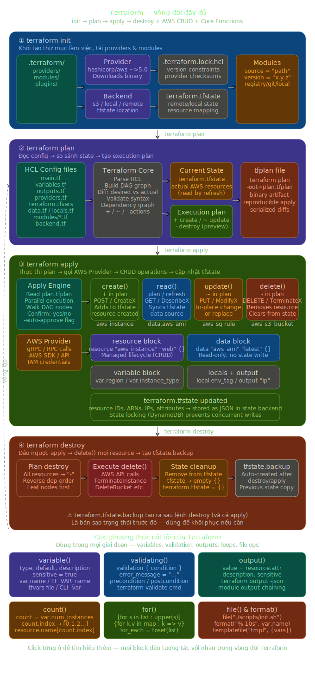

# Terraform Learning Path

> Lộ trình học Terraform từ cơ bản đến production-ready — dành cho người mới bắt đầu.

### Sơ đồ vòng đời Terraform



Sơ đồ mô tả 4 giai đoạn chính (`init` → `plan` → `apply` → `destroy`) và các thành phần liên quan (providers, backend, state, modules).

## Cấu trúc tài liệu

| File                                               | Nội dung                                    | Thời gian ước tính |
| -------------------------------------------------- | ------------------------------------------- | ------------------ |
| [01-iac overview.md](./01-iac overview.md)         | IaC là gì, tại sao cần, so sánh tools       | 30 phút            |
| [02-hcl-syntax.md](./02-hcl-syntax.md)             | HCL syntax — blocks, variables, expressions | 60 phút            |
| [03-workflow.md](./03-workflow.md)                 | Init / Plan / Apply / Destroy               | 45 phút            |
| [04-state-management.md](./04-state-management.md) | State file, remote backend, locking         | 45 phút            |
| [05-modules.md](./05-modules.md)                   | Modules — tái sử dụng code                  | 60 phút            |
| [06-best-practices.md](./06-best-practices.md)     | Best practices & cấu trúc project           | 45 phút            |
| [07-hands-on-aws.md](./07-hands-on-aws.md)         | Lab thực hành trên AWS                      | 90 phút            |

**Tổng:** ~6–7 giờ học + thực hành

---

## Yêu cầu trước khi bắt đầu

- Có tài khoản AWS (free tier đủ dùng)
- Đã cài: `terraform`, `aws-cli`, một editor (VS Code khuyến nghị)
- Hiểu cơ bản về Linux CLI và khái niệm cloud (EC2, S3, VPC)

## Cài đặt nhanh

```bash
# macOS
brew tap hashicorp/tap
brew install hashicorp/tap/terraform

# Kiểm tra
terraform version
```

## Tài nguyên tham khảo

- [HashiCorp Learn](https://developer.hashicorp.com/terraform/tutorials) — tutorials chính thống
- [Terraform Docs](https://developer.hashicorp.com/terraform/docs) — reference đầy đủ
- [Terraform Registry](https://registry.terraform.io) — module marketplace
- [Terraform Best Practices](https://www.terraform-best-practices.com) — community guide
- [Series của Nghĩa Huỳnh](https://kkloudtarus.net/en/blog/series/terraform-from-basics-to-production) — tiếng Việt, production-grade

---

> **Ghi chú:** Đọc theo thứ tự từ file 01 → 07. Mỗi file xây dựng trên kiến thức của file trước.
