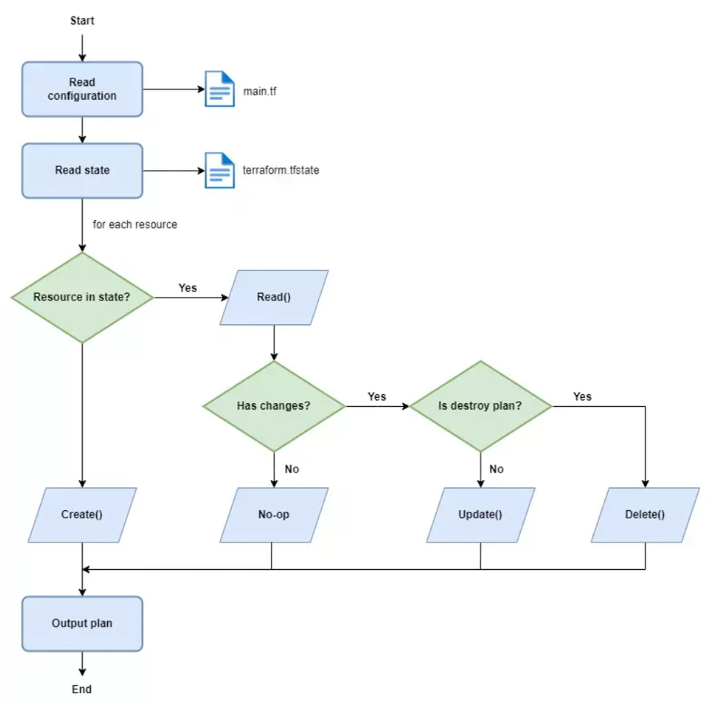

# 03 — Terraform Workflow

> Vòng đời 4 lệnh: `init` → `plan` → `apply` → `destroy`.

---

## Tổng quan vòng đời

```
Viết .tf files
      │
      ▼
terraform init       ← Tải providers, cài đặt modules
      │
      ▼
terraform plan       ← Xem sẽ thay đổi gì (KHÔNG chạm hạ tầng)
      │
      ▼
terraform apply      ← Áp dụng thay đổi vào hạ tầng thật
      │
      ▼
(Khi cần) terraform destroy  ← Xóa toàn bộ resources đã tạo
```

---

## `terraform init`

**Chạy một lần** khi bắt đầu project hoặc sau khi thêm provider/module mới.

```bash
terraform init
```

Lệnh này làm 3 việc:

1. Tải **providers** vào thư mục `.terraform/`
2. Tải **modules** được khai báo
3. Khởi tạo **backend** (nơi lưu state file)

```
Initializing the backend...
Initializing provider plugins...
- Finding hashicorp/aws versions matching "~> 5.0"...
- Installing hashicorp/aws v5.31.0...
Terraform has been successfully initialized!
```

> `.terraform/` và `.terraform.lock.hcl` được tạo ra. Commit `.terraform.lock.hcl` vào Git để đảm bảo mọi người dùng cùng phiên bản provider. Không commit `.terraform/`.

---

## `terraform plan`

### Sơ đồ luồng `terraform plan`



Sơ đồ này mô tả cách Terraform đọc file cấu hình, so sánh với state hiện tại và tạo ra plan để bạn xem trước thay đổi trước khi áp dụng.

**Bước quan trọng nhất** — xem preview thay đổi trước khi apply.

```bash
terraform plan

# Lưu plan ra file để apply sau (dùng trong CI/CD)
terraform plan -out=tfplan
```

### Đọc output của plan

```
Terraform will perform the following actions:

  # aws_instance.web_server will be created
  + resource "aws_instance" "web_server" {
      + ami                    = "ami-0c55b159cbfafe1f0"
      + instance_type          = "t3.micro"
      + id                     = (known after apply)
      + public_ip              = (known after apply)
    }

Plan: 1 to add, 0 to change, 0 to destroy.
```

Ký hiệu quan trọng:

| Ký hiệu | Nghĩa           | Tác động                    |
| ------- | --------------- | --------------------------- |
| `+`     | Create          | Tạo mới resource            |
| `-`     | Destroy         | Xóa resource                |
| `~`     | Update in-place | Sửa không cần recreate      |
| `-/+`   | Replace         | Xóa rồi tạo lại (downtime!) |
| `<=`    | Read            | Chỉ đọc (data source)       |

> **Luôn đọc kỹ plan** trước khi apply, đặc biệt chú ý `destroy` và `-/+` (replace).

---

## `terraform apply`

Áp dụng thay đổi vào hạ tầng thật.

```bash
# Apply với confirmation prompt
terraform apply

# Apply không cần confirm (dùng trong automation)
terraform apply -auto-approve

# Apply từ saved plan (an toàn nhất cho CI/CD)
terraform apply tfplan
```

Terraform sẽ hiện lại plan và hỏi xác nhận:

```
Do you want to perform these actions?
  Terraform will perform the actions described above.
  Only 'yes' will be accepted to approve.

  Enter a value: yes

aws_instance.web_server: Creating...
aws_instance.web_server: Creation complete after 30s [id=i-0abc123def456]

Apply complete! Resources: 1 added, 0 changed, 0 destroyed.

Outputs:
  web_server_ip = "54.123.45.67"
```

---

## `terraform destroy`

Xóa **toàn bộ** resources được quản lý bởi state hiện tại.

```bash
terraform destroy

# Chỉ xóa một resource cụ thể
terraform destroy -target=aws_instance.web_server
```

> **Cẩn thận với destroy trên production!** Không có undo. Terraform sẽ xóa thật.

---

## Các lệnh hữu ích khác

```bash
# Validate cú pháp HCL
terraform validate

# Format code theo chuẩn
terraform fmt
terraform fmt -recursive  # format toàn bộ subdirectories

# Xem state hiện tại
terraform show
terraform state list      # list tất cả resources trong state
terraform state show aws_instance.web_server  # chi tiết 1 resource

# Import resource đã tồn tại vào state
terraform import aws_instance.web_server i-0abc123def456

# Refresh state từ hạ tầng thật
terraform refresh

# Xóa 1 resource khỏi state (không xóa resource thật)
terraform state rm aws_instance.old_server
```

---

## Xử lý Variables lúc chạy

```bash
# Truyền variable qua CLI
terraform apply -var="instance_type=t3.small"

# Dùng file .tfvars
terraform apply -var-file="production.tfvars"

# Terraform tự load terraform.tfvars và *.auto.tfvars
```

**Thứ tự ưu tiên** (cao đến thấp):

1. CLI `-var` và `-var-file`
2. `*.auto.tfvars` (theo alphabet)
3. `terraform.tfvars`
4. Environment variables `TF_VAR_<name>`
5. Default trong `variable` block

---

## Environment Variables hữu ích

```bash
# Tắt prompt confirmation
export TF_INPUT=false

# Set log level (TRACE, DEBUG, INFO, WARN, ERROR)
export TF_LOG=DEBUG
export TF_LOG_PATH=./terraform.log

# Variables qua env
export TF_VAR_instance_type=t3.large
```

---

## Workflow trong thực tế (CI/CD)

```bash
# Stage 1: Pull Request
terraform init
terraform validate
terraform fmt -check
terraform plan -out=tfplan

# Stage 2: Sau khi merge
terraform apply tfplan
```

---

## Kiểm tra hiểu biết

1. `terraform plan` có thay đổi hạ tầng thật không?
2. Ký hiệu `-/+` trong plan có nghĩa là gì và tại sao nguy hiểm?
3. Tại sao nên commit `.terraform.lock.hcl` nhưng không commit `.terraform/`?

---

**Tiếp theo:** [04-state-management.md](./04-state-management.md) — State file là gì và tại sao cần remote backend.
