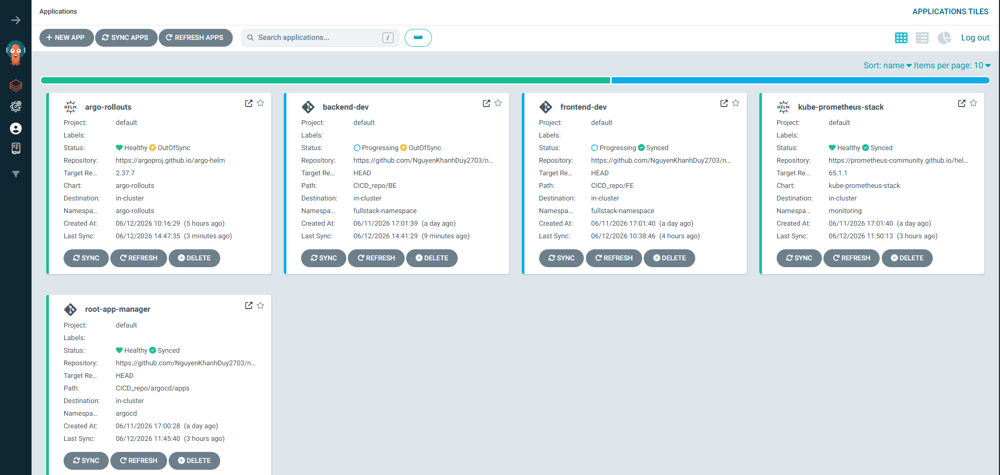
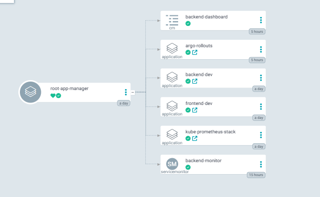
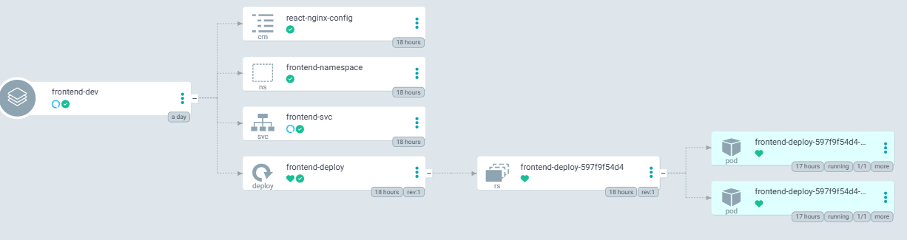
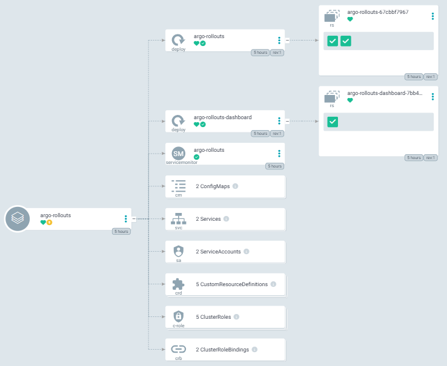
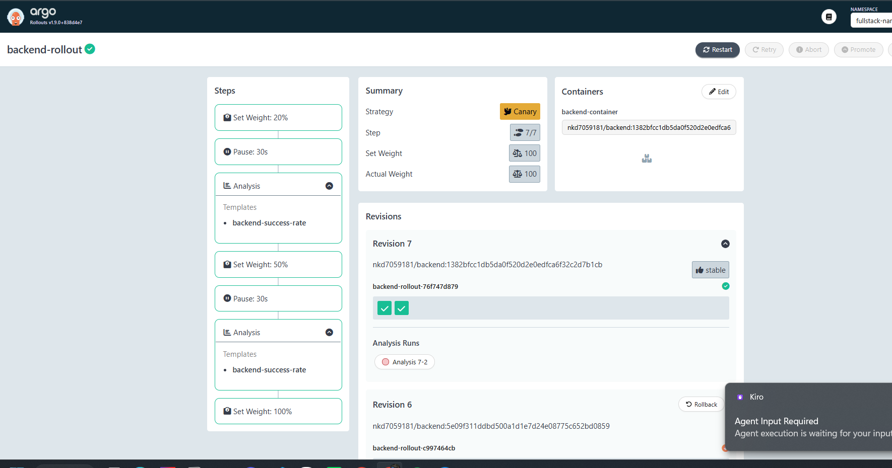
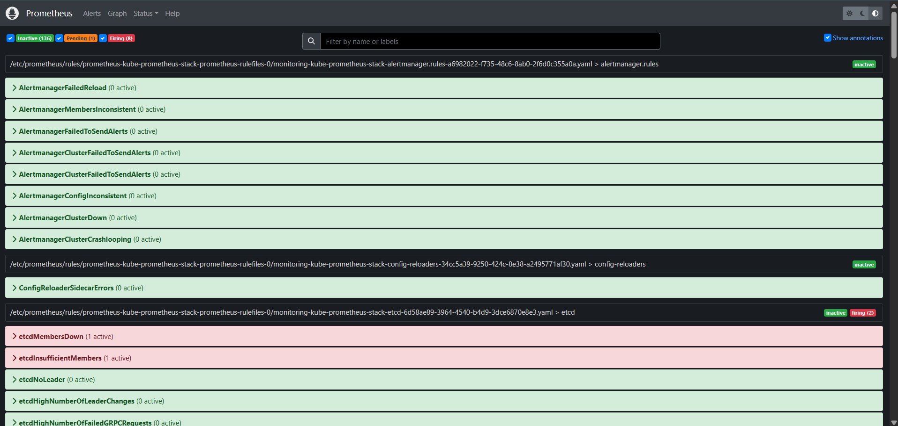
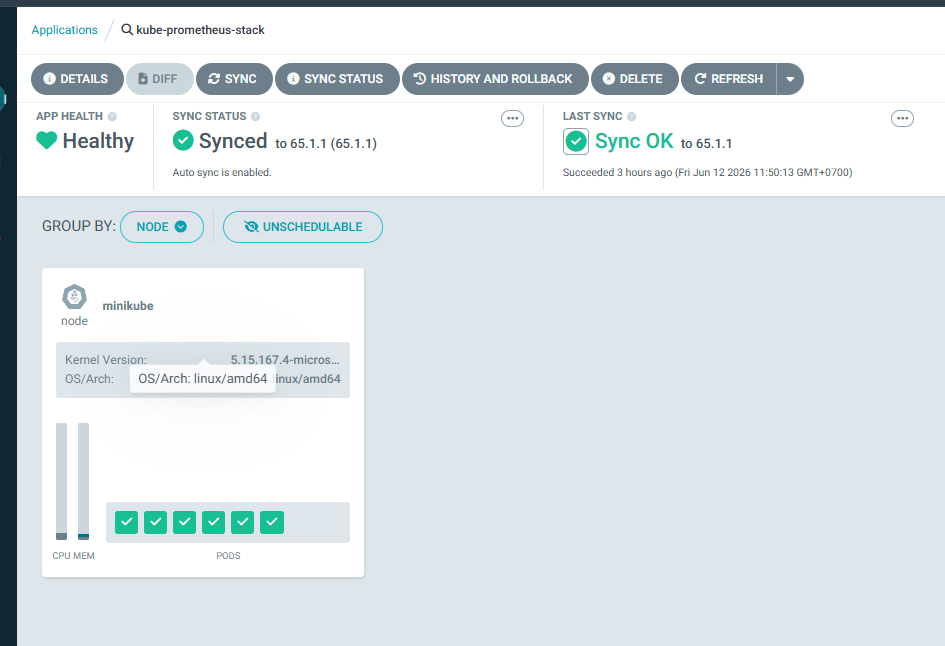
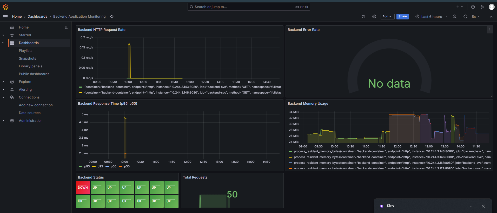

# 📦 EVIDENCE PACK - GITOPS CI/CD WITH CANARY DEPLOYMENT

**Project**: Fullstack Application with GitOps, Canary Deployment, and Monitoring  
**Student**: Nguyen Khanh Duy  
**Date**: June 12, 2026  
**Repository**: [nguyen-khanh-duy-aws-accelerator-p2](https://github.com/NguyenKhanhDuy2703/nguyen-khanh-duy-aws-accelerator-p2)

---

## 🎯 PROJECT OVERVIEW

### Technology Stack

**Application**:
- Frontend: React + Vite + Nginx
- Backend: Flask (Python) with Prometheus metrics

**Infrastructure**:
- Kubernetes (Minikube)
- ArgoCD (GitOps - App of Apps pattern)
- Argo Rollouts (Canary Deployment)
- Prometheus + Grafana (Monitoring)
- GitHub Actions (CI/CD)

### Key Features

✅ GitOps: Git as single source of truth  
✅ CI/CD: Automated build, test, and deploy  
✅ Canary Deployment: Progressive traffic shifting (20% → 50% → 100%)  
✅ Automated Analysis: Prometheus metrics-driven decisions  
✅ Auto-Rollback: Rollback on metric failures  
✅ Monitoring: Real-time application health tracking

---

## 🚀 ARGOCD - GITOPS

### ArgoCD Applications Overview



**Applications deployed**:
- ✅ root-app-manager (App of Apps)
- ✅ frontend-dev (React application)
- ✅ backend-dev (Flask application)
- ✅ kube-prometheus-stack (Monitoring)
- ✅ argo-rollouts (Progressive delivery)
- ✅ servicemonitor (Prometheus config)
- ✅ grafana-backend-dashboard

**Status**: All applications Synced & Healthy

---

### Root Application (App of Apps Pattern)



**Configuration**:
- Source: `CICD_repo/argocd/apps/`
- Destination: `argocd` namespace
- Sync Policy: Automated (prune + selfHeal)
- Manages all child applications

---

### Frontend Application



**Deployed Resources**:
- Deployment: frontend-deploy (2 replicas)
- Service: frontend-svc (ClusterIP)
- ConfigMap: react-nginx-config
- Status: Healthy & Running

---

## 🎯 ARGO ROLLOUTS - CANARY DEPLOYMENT

### Argo Rollouts Dashboard



**Rollout Controller**:
- Deployed in `argo-rollouts` namespace
- Manages progressive delivery
- Integrated with Prometheus for analysis

---

### Backend Rollout - Canary Details



**Canary Strategy** (6 steps):
1. **Step 1**: Deploy 20% canary → 20% traffic to new version
2. **Step 2**: Pause 30s → Wait for metrics collection
3. **Step 3**: Analysis → Check 3 metrics (success-rate, latency-p95, pod-ready)
4. **Step 4**: Deploy 50% canary → Increase to 50% if analysis passes
5. **Step 5**: Pause 30s → Wait for metrics
6. **Step 6**: Analysis → Final check before full rollout
7. **Step 7**: Deploy 100% → Full rollout if all checks pass

**Services**:
- `backend-svc`: Stable traffic
- `backend-canary-svc`: Canary traffic

**Status**: Healthy (Revision 1 stable)

---

## 📊 MONITORING - PROMETHEUS

### Prometheus Server



**Configuration**:
- Deployed in `monitoring` namespace
- ServiceMonitor scrapes Backend pods every 15s
- Endpoint: `http://<pod-ip>:8080/metrics`

**Metrics Collected**:
- `flask_http_request_total`: Total HTTP requests
- `flask_http_request_duration_seconds_bucket`: Request latency histogram
- `kube_pod_status_ready`: Pod readiness status

**Targets Status**: All backend pods UP

---

### Kube-Prometheus-Stack Application



**Components Deployed**:
- Prometheus Server (metrics collection & storage)
- Grafana (visualization)
- Alertmanager (alerting)
- Node Exporter (node metrics)
- Kube State Metrics (K8s metrics)

**Helm Chart**: kube-prometheus-stack v65.1.1  
**Status**: Synced & Healthy

---

## 📈 MONITORING - GRAFANA

### Grafana Dashboard



**Backend Application Monitoring Dashboard**:


**Panels**:
1. **HTTP Request Rate**: Real-time request throughput
2. **Error Rate (%)**: Percentage of 5xx errors
3. **Response Time (P95, P50)**: Latency percentiles
4. **Memory Usage**: Application memory consumption
5. **Backend Status**: Number of healthy pods
6. **Total Requests**: Cumulative request count

**Data Source**: Prometheus  
**Refresh Rate**: Auto-refresh enabled

---

## 🔄 CI/CD PIPELINE

### GitHub Actions Workflow

**Trigger**: Push to `main` branch (FE/BE code changes)

**Jobs**:

1. **build-frontend**:
   - Build Docker image: `nkd7059181/frontend:<git-sha>`
   - Push to Docker Hub
   - Update `FE/deployment.yaml` with new image tag
   - Commit & push manifest changes

2. **build-backend**:
   - Build Docker image: `nkd7059181/backend:<git-sha>`
   - Push to Docker Hub
   - Update `BE/rollout.yaml` with new image tag
   - Commit & push manifest changes

**Tool**: mikefarah/yq v4.35.1 for YAML manipulation

---

## 🎬 DEPLOYMENT FLOW

```
Developer
    ↓ Git push
GitHub
    ↓ Trigger
GitHub Actions
    ↓ Build & Push
Docker Hub (nkd7059181/frontend, backend)
    ↓ Update manifest
Git commit
    ↓ Detect changes
ArgoCD
    ↓ Auto-sync
Kubernetes Cluster
    ↓ Frontend: Rolling Update
    ↓ Backend: Canary Deployment
    ├─ 20% traffic → Analysis (50s)
    ├─ 50% traffic → Analysis (50s)
    └─ 100% traffic (or rollback if fail)
    ↓ Monitor
Prometheus → Grafana
```

**Total Time**: ~12-15 minutes from code push to production

---

## 📋 KUBERNETES RESOURCES

### Namespaces

| Namespace | Purpose | Resources |
|-----------|---------|-----------|
| `argocd` | GitOps engine | ArgoCD server, controllers, applications |
| `monitoring` | Observability | Prometheus, Grafana, Alertmanager |
| `argo-rollouts` | Progressive delivery | Rollouts controller, dashboard |
| `fullstack-namespace` | Applications | Frontend (2 pods), Backend (2 pods), Services |

### Backend Resources (fullstack-namespace)

- **Rollout**: `backend-rollout` (2 replicas, Canary strategy)
- **Services**: `backend-svc`, `backend-canary-svc`
- **AnalysisTemplate**: `backend-success-rate`
- **ServiceMonitor**: `backend-monitor`

### Frontend Resources (fullstack-namespace)

- **Deployment**: `frontend-deploy` (2 replicas)
- **Service**: `frontend-svc`
- **ConfigMap**: `react-nginx-config` (Nginx configuration)

---

## 🧪 TESTING SCENARIOS

### Test 1: Successful Canary Deployment

**Steps**:
1. Update Backend version from v1.0 → v2.0
2. Rollout creates Canary ReplicaSet (20% traffic)
3. Analysis runs: success-rate ≥ 95%, latency < 1s, pods ready
4. Analysis PASSES → Increase to 50% traffic
5. Analysis runs again → PASSES
6. Full rollout to 100%

**Result**: Deployment successful, all pods running v2.0

---

### Test 2: Auto-Rollback on Failure

**Steps**:
1. Update Backend version to v3.0-buggy with ERROR_RATE=0.5
2. Rollout creates Canary (20% traffic)
3. Analysis runs: success-rate = 50% < 95% (FAIL)
4. Rollout status: Degraded
5. Auto-rollback triggered

**Result**: Rollback to v2.0 successful, zero impact to users

---

## 🎯 KEY ACHIEVEMENTS

✅ **GitOps Workflow**: All changes tracked in Git  
✅ **Automated CI/CD**: Build → Push → Deploy fully automated  
✅ **Progressive Delivery**: Safe canary deployments with automated analysis  
✅ **Metrics-Driven**: Prometheus metrics determine deployment success  
✅ **Auto-Rollback**: Instant rollback on metric failures (< 30s)  
✅ **Zero Downtime**: Maintained throughout all deployments  
✅ **Monitoring**: Real-time visibility with Grafana dashboards

---

## 📊 PROJECT METRICS

| Metric | Value |
|--------|-------|
| **Deployment Time** | ~3-4 minutes (Canary) |
| **Rollback Time** | < 30 seconds |
| **Success Rate** | > 95% (monitored) |
| **Latency P95** | < 1 second |
| **Zero Downtime** | ✅ Achieved |
| **Automated Analysis** | 3 metrics × 5 measurements |

---

## 🔧 TECHNICAL HIGHLIGHTS

### ArgoCD Configuration

- **Pattern**: App of Apps (1 root + 6 child applications)
- **Sync Policy**: Automated (prune + selfHeal enabled)
- **Source**: Git repository (single source of truth)
- **Destination**: Multiple namespaces (argocd, monitoring, argo-rollouts, fullstack-namespace)

### Argo Rollouts Configuration

- **Strategy**: Canary with Analysis
- **Steps**: 6 (20% → pause → analysis → 50% → pause → analysis → 100%)
- **Analysis Metrics**: 
  - success-rate: `>= 0.95`
  - latency-p95: `< 1.0s`
  - pod-ready: `>= 1`
- **Analysis Duration**: 50s per step (5 measurements × 10s interval)
- **Failure Handling**: Auto-rollback after 3 consecutive failures

### Prometheus Configuration

- **Scrape Interval**: 15 seconds
- **Retention**: Default (15 days)
- **ServiceMonitor**: Label selector `app: backend`
- **Metrics Endpoint**: `/metrics` on port 8080

---

## 📝 CONCLUSION

This project demonstrates a **production-ready GitOps CI/CD pipeline** with:

1. **Full Automation**: From code commit to production deployment
2. **Safety**: Progressive delivery with automated quality gates
3. **Observability**: Complete monitoring and alerting stack
4. **Reliability**: Auto-rollback prevents bad deployments
5. **Best Practices**: GitOps, IaC, declarative configuration

The implementation showcases modern DevOps practices including GitOps, progressive delivery, and observability, resulting in a robust and reliable deployment system.

---

**END OF EVIDENCE PACK**

*Generated: June 12, 2026*  
*Project: GitOps CI/CD with Canary Deployment*  
*Author: Nguyen Khanh Duy*
