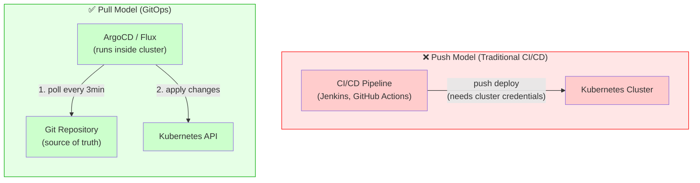
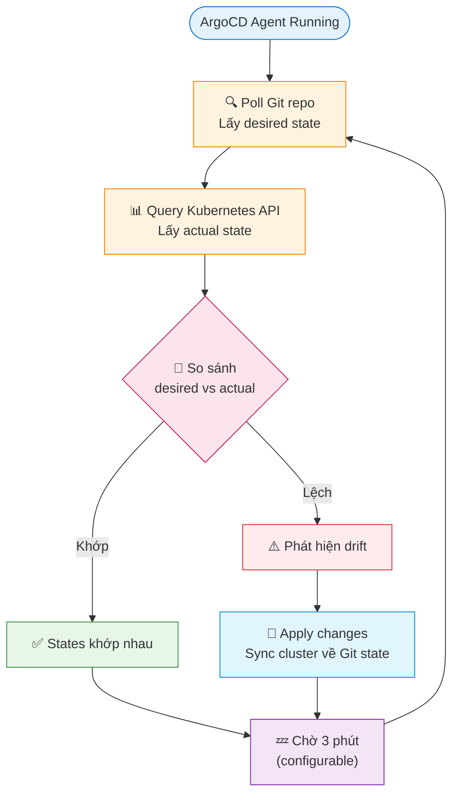
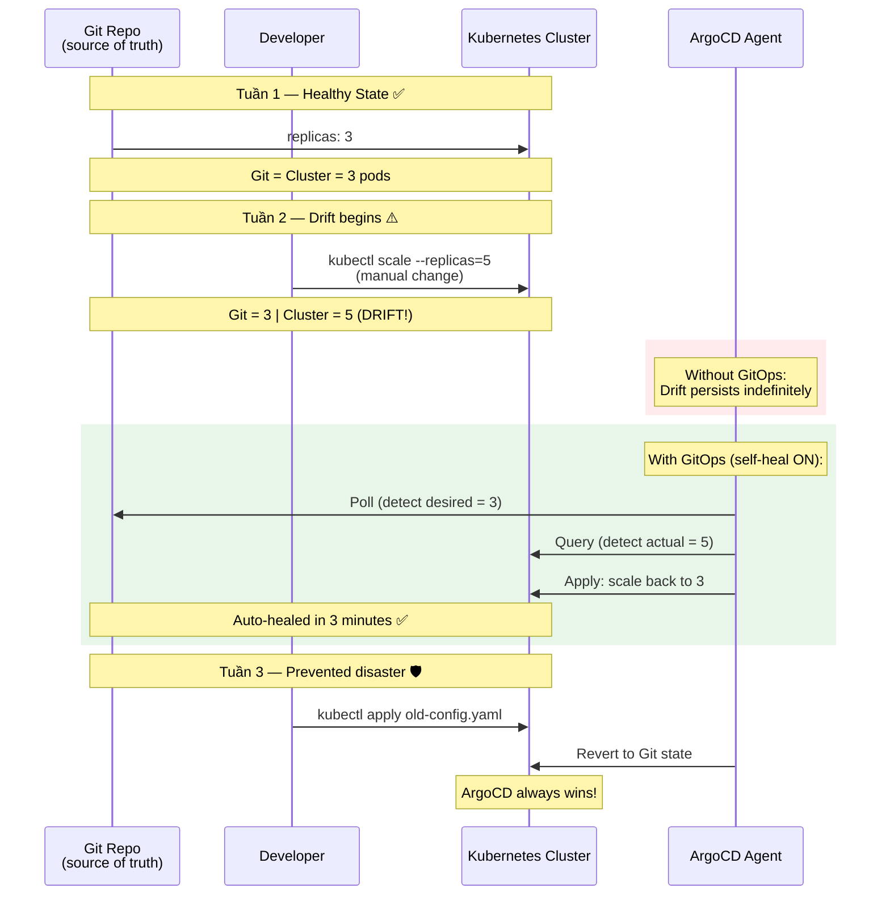

# 01 — GitOps Principles: 4 nguyên tắc cốt lõi

> Nguồn: [OpenGitOps](https://opengitops.dev) — chuẩn do CNCF định nghĩa

---

## GitOps là gì?

GitOps là **phương pháp vận hành hạ tầng** trong đó:

- Toàn bộ trạng thái hệ thống được **khai báo dưới dạng file** (YAML, HCL, JSON)
- Các file đó được lưu trong **Git** là nơi duy nhất đáng tin cậy
- Một **agent tự động** (ArgoCD, Flux) liên tục đảm bảo cluster khớp với Git

GitOps **không phải** là một tool cụ thể — nó là một tập nguyên tắc. ArgoCD và Flux là các implementation của các nguyên tắc đó.

---

## 4 nguyên tắc cốt lõi (OpenGitOps v1.0)

### Nguyên tắc 1: Declarative (Khai báo)

Mô tả **cái gì** bạn muốn, không phải **làm thế nào** để đạt được nó.

```yaml
# ✅ GitOps style — khai báo desired state
apiVersion: apps/v1
kind: Deployment
spec:
  replicas: 3          # "Tôi muốn 3 replicas"
  template:
    spec:
      containers:
      - image: myapp:v2.1.0

# ❌ Non-GitOps — imperative
kubectl scale deployment myapp --replicas=3
kubectl set image deployment/myapp myapp=myapp:v2.1.0
```

**Tại sao quan trọng:** Lệnh imperative không để lại dấu vết trong Git, không thể audit, không thể rollback bằng `git revert`.

---

### Nguyên tắc 2: Versioned and Immutable (Có phiên bản, bất biến)

Git history chính là **audit log** của toàn bộ hệ thống.

```bash
git log --oneline k8s/production/
# a3f1c2d Deploy myapp v2.1.0 (2024-01-15 14:32 - @alice)
# 8b2e1f0 Scale API to 5 replicas (2024-01-14 09:15 - @bob)
# 3d4c5a1 Add Redis cache layer (2024-01-13 16:00 - @charlie)
```

Mỗi commit = một deployment record, có thể:
- Xem ai thay đổi gì (`git blame`)
- Rollback chính xác về thời điểm nào (`git revert`)
- So sánh 2 thời điểm bất kỳ (`git diff`)

---

### Nguyên tắc 3: Pulled Automatically (Kéo tự động)

Agent (ArgoCD/Flux) **kéo** (pull) thay đổi từ Git, **không phải** CI/CD push lên cluster.



**Lợi ích bảo mật:** CI pipeline chỉ cần quyền push lên Git/registry, không cần `kubectl` credentials. Nếu CI bị compromise, attacker không thể deploy thẳng vào cluster.

**Lợi ích bảo mật:** CI pipeline chỉ cần quyền push lên Git/registry, không cần `kubectl` credentials. Nếu CI bị compromise, attacker không thể deploy thẳng vào cluster.

---

### Nguyên tắc 4: Continuously Reconciled (Liên tục đồng bộ)

Agent không chỉ deploy một lần — nó **liên tục** kiểm tra và sửa drift.



**Self-healing trong thực tế:**

```bash
# Ai đó sửa tay trên cluster lúc 2 giờ sáng
kubectl scale deployment myapp --replicas=1   # panic!

# 3 phút sau, ArgoCD phát hiện drift
# ArgoCD tự scale lại về replicas: 3 như trong Git
# Không cần ai làm gì
```

---

## Configuration Drift — vấn đề mà GitOps giải quyết



Với GitOps (ArgoCD self-heal ON):
- Bước 2: ArgoCD phát hiện trong 3 phút, revert về 3
- Bước 3: Không thể xảy ra vì `kubectl apply` sẽ bị ArgoCD override

---

## GitOps không phải silver bullet

| Tình huống | GitOps có giúp không? |
|---|---|
| Stateless app deployment | ✅ Rất phù hợp |
| Kubernetes config management | ✅ Rất phù hợp |
| Database schema migration | ⚠️ Cần tool thêm (PreSync hooks) |
| Secret management | ⚠️ Cần Sealed Secrets / Vault |
| Stateful workload (databases) | ⚠️ Phức tạp hơn |
| Non-Kubernetes infra (EC2, RDS) | ❌ Dùng Terraform thay thế |

---

*File tiếp theo: [02-github-actions.md](./02-github-actions.md)*
