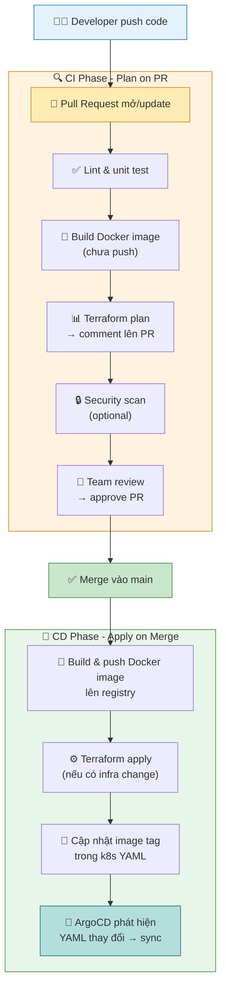
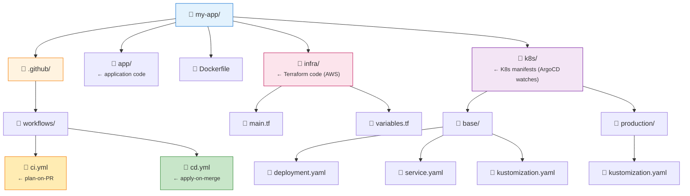

# 02 — GitHub Actions: Plan-on-PR + Apply-on-Merge

> Đây là phần **CI** trong chuỗi CI/CD.  
> GitHub Actions lo phần build, test, và chuẩn bị artifacts.  
> ArgoCD lo phần deploy (CD) — xem file 04.

---

## Tổng quan workflow



---

## Workflow 1: Plan-on-PR (CI)

File: `.github/workflows/ci.yml`

```yaml
name: CI — Plan on PR

on:
  pull_request:
    branches: [main]

jobs:
  test:
    name: Lint & Test
    runs-on: ubuntu-latest
    steps:
      - uses: actions/checkout@v4

      - name: Set up Python
        uses: actions/setup-python@v5
        with:
          python-version: "3.11"

      - name: Install dependencies
        run: pip install -r requirements.txt

      - name: Run tests
        run: pytest --cov=app tests/

  build-check:
    name: Build Docker Image (no push)
    runs-on: ubuntu-latest
    needs: test
    steps:
      - uses: actions/checkout@v4

      - name: Build image (dry-run)
        run: |
          docker build -t myapp:${{ github.sha }} .
          # Chỉ build để verify, không push

  terraform-plan:
    name: Terraform Plan
    runs-on: ubuntu-latest
    permissions:
      pull-requests: write    # cần để comment lên PR
      contents: read
    steps:
      - uses: actions/checkout@v4

      - name: Setup Terraform
        uses: hashicorp/setup-terraform@v3
        with:
          terraform_version: "~1.7"

      - name: Terraform Init
        run: terraform init
        working-directory: ./infra
        env:
          AWS_ACCESS_KEY_ID: ${{ secrets.AWS_ACCESS_KEY_ID }}
          AWS_SECRET_ACCESS_KEY: ${{ secrets.AWS_SECRET_ACCESS_KEY }}

      - name: Terraform Plan
        id: plan
        run: terraform plan -no-color -out=tfplan
        working-directory: ./infra
        continue-on-error: true   # workflow không fail nếu plan có thay đổi

      - name: Comment Plan trên PR
        uses: actions/github-script@v7
        with:
          github-token: ${{ secrets.GITHUB_TOKEN }}
          script: |
            const plan = `${{ steps.plan.outputs.stdout }}`;
            const status = `${{ steps.plan.outcome }}`;
            const emoji = status === 'success' ? '✅' : '❌';

            github.rest.issues.createComment({
              issue_number: context.issue.number,
              owner: context.repo.owner,
              repo: context.repo.repo,
              body: `## ${emoji} Terraform Plan Result\n\`\`\`\n${plan}\n\`\`\``
            });
```

**Điều quan trọng:** `continue-on-error: true` ở bước plan — nếu plan thành công (có thay đổi để apply) thì bước outcome là `'success'`, nhưng nếu plan thất bại (lỗi syntax Terraform) thì là `'failure'`. Workflow vẫn chạy tiếp để post comment với lỗi.

---

## Workflow 2: Apply-on-Merge (CD)

File: `.github/workflows/cd.yml`

```yaml
name: CD — Apply on Merge

on:
  push:
    branches: [main]    # trigger khi PR được merge

env:
  REGISTRY: ghcr.io
  IMAGE_NAME: ${{ github.repository }}

jobs:
  build-and-push:
    name: Build & Push Docker Image
    runs-on: ubuntu-latest
    outputs:
      image-tag: ${{ steps.meta.outputs.tags }}
      image-digest: ${{ steps.build.outputs.digest }}

    permissions:
      contents: read
      packages: write

    steps:
      - uses: actions/checkout@v4

      - name: Log in to GitHub Container Registry
        uses: docker/login-action@v3
        with:
          registry: ${{ env.REGISTRY }}
          username: ${{ github.actor }}
          password: ${{ secrets.GITHUB_TOKEN }}

      - name: Extract metadata (tags, labels)
        id: meta
        uses: docker/metadata-action@v5
        with:
          images: ${{ env.REGISTRY }}/${{ env.IMAGE_NAME }}
          tags: |
            type=sha,prefix=,suffix=,format=short
            type=ref,event=branch

      - name: Build and push
        id: build
        uses: docker/build-push-action@v5
        with:
          context: .
          push: true
          tags: ${{ steps.meta.outputs.tags }}
          labels: ${{ steps.meta.outputs.labels }}

  terraform-apply:
    name: Terraform Apply
    runs-on: ubuntu-latest
    needs: build-and-push
    environment: production    # yêu cầu manual approval nếu config trên GitHub

    steps:
      - uses: actions/checkout@v4

      - name: Setup Terraform
        uses: hashicorp/setup-terraform@v3

      - name: Terraform Init & Apply
        run: |
          terraform init
          terraform apply -auto-approve
        working-directory: ./infra
        env:
          AWS_ACCESS_KEY_ID: ${{ secrets.AWS_ACCESS_KEY_ID }}
          AWS_SECRET_ACCESS_KEY: ${{ secrets.AWS_SECRET_ACCESS_KEY }}

  update-k8s-manifests:
    name: Update Image Tag in K8s YAML
    runs-on: ubuntu-latest
    needs: build-and-push

    steps:
      - uses: actions/checkout@v4
        with:
          token: ${{ secrets.GITHUB_TOKEN }}

      - name: Update image tag
        run: |
          IMAGE_TAG=$(echo "${{ github.sha }}" | cut -c1-7)
          sed -i "s|image: ghcr.io/myorg/myapp:.*|image: ghcr.io/myorg/myapp:${IMAGE_TAG}|g" \
            k8s/production/deployment.yaml

      - name: Commit & Push
        run: |
          git config user.name "github-actions[bot]"
          git config user.email "github-actions[bot]@users.noreply.github.com"
          git add k8s/production/deployment.yaml
          git commit -m "ci: update image tag to ${{ github.sha }}"
          git push
```

Sau bước `git push` này, ArgoCD sẽ phát hiện thay đổi trong YAML và tự sync.

---

## Cấu trúc thư mục repo khuyến nghị



---

## Các pattern nâng cao

### Concurrency control — tránh 2 workflow chạy cùng lúc

```yaml
concurrency:
  group: ${{ github.workflow }}-${{ github.ref }}
  cancel-in-progress: true   # cancel workflow cũ nếu có PR update mới
```

### OIDC thay vì long-lived AWS credentials

```yaml
permissions:
  id-token: write
  contents: read

steps:
  - name: Configure AWS via OIDC (không cần secret key)
    uses: aws-actions/configure-aws-credentials@v4
    with:
      role-to-assume: arn:aws:iam::123456789012:role/github-actions-role
      aws-region: us-east-1
```

OIDC an toàn hơn vì: không lưu `AWS_SECRET_ACCESS_KEY` trong GitHub Secrets, token chỉ sống trong thời gian job chạy.

### Environment với manual approval

```yaml
jobs:
  deploy-prod:
    environment: production   # tên environment được cấu hình trên GitHub repo settings
    # → GitHub sẽ hỏi người có quyền approve trước khi chạy job này
```

---

## Tóm tắt sự khác biệt CI vs CD

| | CI (plan-on-PR) | CD (apply-on-merge) |
|---|---|---|
| Trigger | `pull_request` event | `push` to main |
| Mục đích | Kiểm tra, hiển thị diff | Thực sự thay đổi hệ thống |
| Thay đổi infra? | Chỉ `plan`, không `apply` | `apply` thật |
| Push image? | Không | Có |
| Cần review? | Team review PR | Có thể cần manual approval |

---

*File tiếp theo: [03-argocd-vs-flux.md](./03-argocd-vs-flux.md)*
