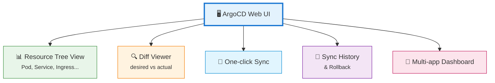
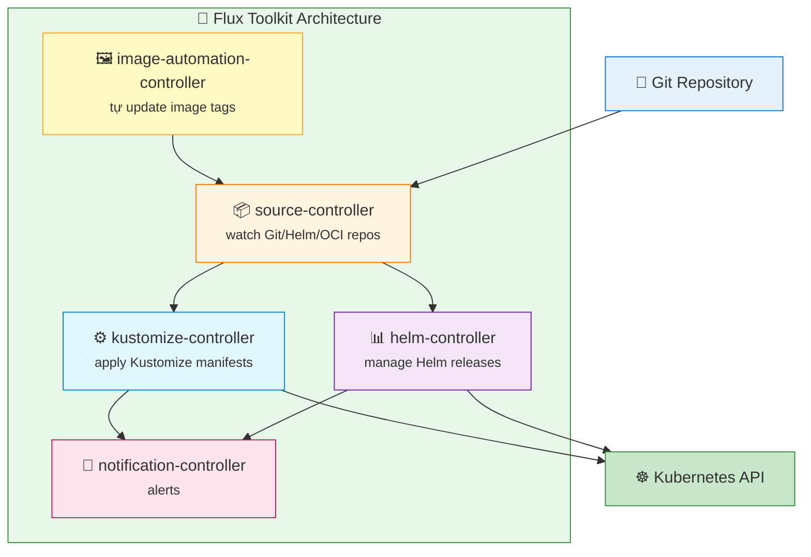
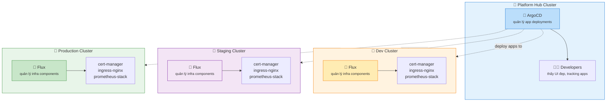

# 03 — ArgoCD vs Flux: So sánh 2 GitOps Engine

> Cả hai đều là CNCF Graduated projects — đều production-ready.  
> Sự khác biệt nằm ở triết lý thiết kế và trải nghiệm vận hành.

---

## So sánh nhanh

| Tiêu chí | ArgoCD | Flux |
|---|---|---|
| **Giao diện** | Web UI đẹp, trực quan | CLI-first, không có UI mặc định |
| **Kiến trúc** | Monolithic (1 binary nhiều tính năng) | Modular (nhiều controller nhỏ) |
| **Cài đặt** | 2 lệnh `kubectl apply` | `flux bootstrap` |
| **RBAC** | Built-in, chi tiết | Dựa vào Kubernetes RBAC |
| **Multi-cluster** | Native, từ 1 control plane | Mỗi cluster cần 1 Flux instance |
| **Resource usage** | Nặng hơn (~500MB RAM) | Nhẹ hơn (~200MB RAM) |
| **SSO** | Built-in (OIDC, SAML, GitHub OAuth) | Cần tự cấu hình |
| **Sync waves** | Có (`sync-wave` annotation) | Có (`dependsOn` field) |
| **Notification** | ArgoCD Notifications built-in | Notification Controller riêng |
| **Helm support** | Tốt | Tốt hơn (HelmRelease CRD native) |

---

## ArgoCD — Phù hợp khi nào?

### Thế mạnh

**1. Web UI là điểm mạnh số 1**



**2. App-of-Apps pattern** — quản lý hàng trăm app từ 1 root Application (xem file 04).

**3. Multi-tenant với Projects**

```yaml
apiVersion: argoproj.io/v1alpha1
kind: AppProject
metadata:
  name: team-backend
spec:
  sourceRepos:
    - 'https://github.com/myorg/backend-*'   # chỉ được deploy từ repo này
  destinations:
    - namespace: backend-*                    # chỉ được deploy vào namespace backend
      server: https://kubernetes.default.svc
  clusterResourceWhitelist:
    - group: ''
      kind: Namespace
```

**Chọn ArgoCD khi:**
- Team cần visibility cao — PM, SRE, manager xem được deployment status
- Multi-tenant: nhiều team dùng chung 1 cluster
- Muốn onboard nhanh — UI giúp junior devs hiểu được GitOps ngay
- Quản lý nhiều app phức tạp với dependency

---

## Flux — Phù hợp khi nào?

### Thế mạnh

**1. Kubernetes-native 100%** — mọi thứ là CRD

```yaml
# Flux dùng CRD thay vì UI clicks
apiVersion: source.toolkit.fluxcd.io/v1
kind: GitRepository
metadata:
  name: my-app
spec:
  interval: 1m
  url: https://github.com/myorg/my-app
  ref:
    branch: main
---
apiVersion: kustomize.toolkit.fluxcd.io/v1
kind: Kustomization
metadata:
  name: my-app
spec:
  interval: 10m
  path: ./k8s
  prune: true
  sourceRef:
    kind: GitRepository
    name: my-app
```

**2. Modular — chỉ cài những gì cần**



**3. Air-gapped environments** — không cần internet access từ cluster, chỉ cần Git server nội bộ.

**4. Helm-native hơn** — `HelmRelease` CRD cho phép quản lý Helm lifecycle hoàn chỉnh.

```yaml
apiVersion: helm.toolkit.fluxcd.io/v2
kind: HelmRelease
metadata:
  name: podinfo
spec:
  interval: 5m
  chart:
    spec:
      chart: podinfo
      version: '>=6.0.0'
      sourceRef:
        kind: HelmRepository
        name: podinfo
  values:
    replicaCount: 2
```

**Chọn Flux khi:**
- Platform team, SRE chuyên nghiệp — ổn với CLI
- Resource bị giới hạn (edge cluster, IoT, small VM)
- Air-gapped hoặc strict network isolation
- Helm-heavy workloads
- Muốn mọi thứ là Kubernetes native (GitOps repo = single source of truth cho config)

---

## Điểm giống nhau quan trọng

Cả hai đều:

- Là CNCF Graduated (production-ready, có long-term support)
- Hỗ trợ Kubernetes manifests, Helm, Kustomize
- Có reconciliation loop (phát hiện và sửa drift)
- Hỗ trợ progressive delivery khi kết hợp với Argo Rollouts / Flagger
- Có notification (Slack, PagerDuty, etc.)
- Hỗ trợ multi-cluster (cách khác nhau)

---

## Hybrid pattern — dùng cả hai

Một số enterprise dùng cả hai theo phân chia rõ ràng:



**Nguyên tắc:** ArgoCD và Flux không được watch cùng 1 directory trong Git — sẽ conflict.

---

## Kết luận cho W9 lab

Trong lab W9, bạn sẽ dùng **ArgoCD** vì:

1. Web UI giúp bạn nhìn thấy trực quan ArgoCD đang làm gì
2. App-of-Apps pattern dễ hiểu hơn với beginners
3. Community lớn hơn → dễ tìm tutorial và troubleshoot
4. Sync waves và hooks được document rõ hơn

---

*File tiếp theo: [04-argocd-deep-dive.md](./04-argocd-deep-dive.md)*
