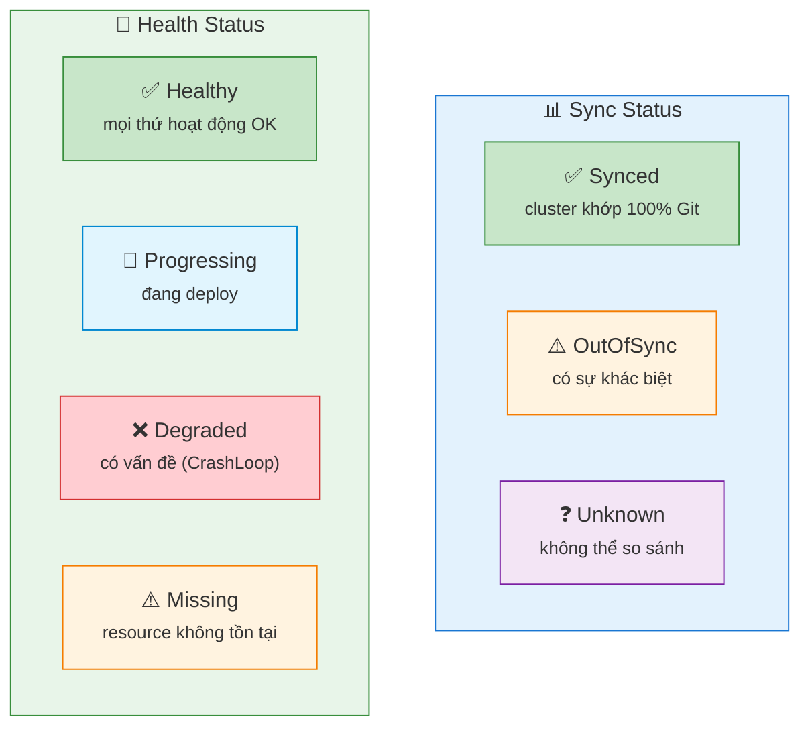
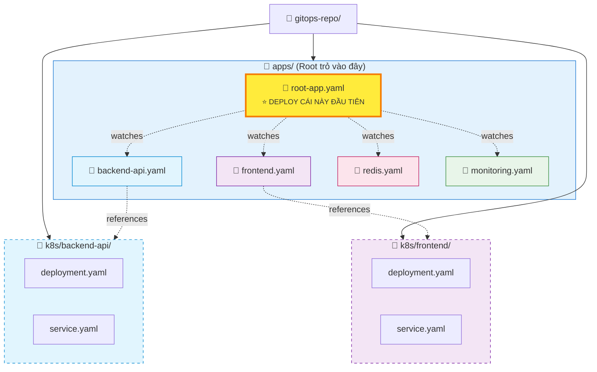
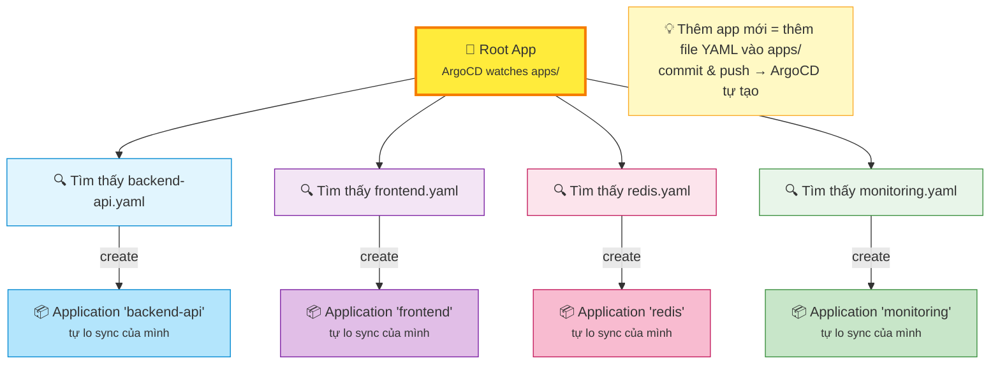
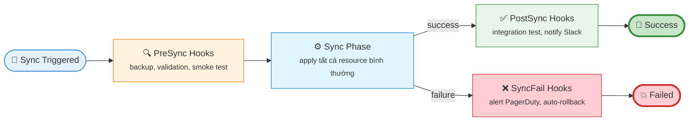

# 04 — ArgoCD Deep Dive: App-of-Apps, Sync Waves, Cài đặt

---

## Cài đặt ArgoCD

```bash
# 1. Tạo namespace
kubectl create namespace argocd

# 2. Cài ArgoCD (stable manifest)
kubectl apply -n argocd -f \
  https://raw.githubusercontent.com/argoproj/argo-cd/stable/manifests/install.yaml

# 3. Chờ pods sẵn sàng
kubectl wait --for=condition=Ready pods --all -n argocd --timeout=120s

# 4. Lấy initial admin password
kubectl get secret argocd-initial-admin-secret \
  -n argocd -o jsonpath="{.data.password}" | base64 -d

# 5. Port-forward để truy cập UI
kubectl port-forward svc/argocd-server -n argocd 8080:443
# Mở https://localhost:8080, login: admin / <password ở bước 4>
```

---

## ArgoCD Application — unit cơ bản

Mọi thứ trong ArgoCD xoay quanh resource `Application`:

```yaml
apiVersion: argoproj.io/v1alpha1
kind: Application
metadata:
  name: my-app
  namespace: argocd
  finalizers:
    - resources-finalizer.argocd.argoproj.io  # xóa app → xóa resource K8s
spec:
  project: default

  source:
    repoURL: https://github.com/myorg/gitops-repo.git
    targetRevision: main           # branch, tag, hoặc commit SHA
    path: k8s/production           # thư mục trong repo

  destination:
    server: https://kubernetes.default.svc   # cluster nào
    namespace: production                    # namespace nào

  syncPolicy:
    automated:
      prune: true        # xóa resource không còn trong Git
      selfHeal: true     # tự revert drift
    syncOptions:
      - CreateNamespace=true   # tạo namespace nếu chưa có
```

### Các trạng thái của Application



---

## App-of-Apps Pattern

### Vấn đề khi quản lý nhiều app

Khi cluster có 20+ applications, việc tạo từng `Application` YAML thủ công rất khó quản lý và dễ mất đồng bộ.

### Giải pháp: App-of-Apps

Tạo 1 "root" Application trỏ vào thư mục chứa toàn bộ các Application YAML khác.



**Root Application** (deploy 1 lần duy nhất bằng `kubectl apply`):

```yaml
# apps/root-app.yaml
apiVersion: argoproj.io/v1alpha1
kind: Application
metadata:
  name: root-app
  namespace: argocd
spec:
  project: default
  source:
    repoURL: https://github.com/myorg/gitops-repo.git
    targetRevision: main
    path: apps           # ← trỏ vào thư mục chứa các Application khác
  destination:
    server: https://kubernetes.default.svc
    namespace: argocd    # ← Application resources deploy vào namespace argocd
  syncPolicy:
    automated:
      prune: true
      selfHeal: true
```

**Child Applications** (trong thư mục `apps/`):

```yaml
# apps/backend-api.yaml
apiVersion: argoproj.io/v1alpha1
kind: Application
metadata:
  name: backend-api
  namespace: argocd
spec:
  project: default
  source:
    repoURL: https://github.com/myorg/gitops-repo.git
    targetRevision: main
    path: k8s/backend-api   # ← manifests của backend
  destination:
    server: https://kubernetes.default.svc
    namespace: production
  syncPolicy:
    automated:
      prune: true
      selfHeal: true
```

### Kết quả



---

## Sync Waves — Kiểm soát thứ tự deploy

### Vấn đề

Khi sync, ArgoCD apply tất cả resource cùng lúc. Điều này gây vấn đề nếu:
- `Deployment` cần `ConfigMap` đã tồn tại trước
- `Deployment` cần database migration chạy xong trước
- `Ingress` cần `Service` sẵn sàng trước

### Giải pháp: Sync Waves

Annotate từng resource với số wave. ArgoCD deploy theo thứ tự tăng dần, **chờ tất cả resource ở wave N healthy** trước khi sang wave N+1.

```yaml
# Wave -1: Namespace (phải có trước mọi thứ)
apiVersion: v1
kind: Namespace
metadata:
  name: production
  annotations:
    argocd.argoproj.io/sync-wave: "-1"

---
# Wave 0: ConfigMap và Secret (mặc định, không cần annotation)
apiVersion: v1
kind: ConfigMap
metadata:
  name: app-config
  # sync-wave: "0" là mặc định

---
# Wave 1: Database migration Job (chạy sau ConfigMap)
apiVersion: batch/v1
kind: Job
metadata:
  name: db-migrate
  annotations:
    argocd.argoproj.io/sync-wave: "1"
    argocd.argoproj.io/hook: PreSync         # chạy trước phase Sync chính
    argocd.argoproj.io/hook-delete-policy: HookSucceeded  # xóa Job sau khi thành công
spec:
  template:
    spec:
      containers:
      - name: migrate
        image: myapp:latest
        command: ["python", "manage.py", "migrate"]
      restartPolicy: Never

---
# Wave 2: Deployment (chạy sau migration)
apiVersion: apps/v1
kind: Deployment
metadata:
  name: api-server
  annotations:
    argocd.argoproj.io/sync-wave: "2"
spec:
  replicas: 3
  # ...

---
# Wave 3: Ingress (chạy cuối, sau Service và Deployment sẵn sàng)
apiVersion: networking.k8s.io/v1
kind: Ingress
metadata:
  name: api-ingress
  annotations:
    argocd.argoproj.io/sync-wave: "3"
```

### Thứ tự thực tế

```mermaid
flowchart TD
    START([🚀 Sync Start]) --> WAVE_NEG1
    
    WAVE_NEG1["⬇️ Wave -1<br/>Namespace"]
    CHECK_NEG1{"✅ Healthy?"}
    DELAY1["⏱️ Delay 2s"]
    
    WAVE_0["⬇️ Wave 0<br/>ConfigMap, Secret"]
    CHECK_0{"✅ Healthy?"}
    DELAY2["⏱️ Delay 2s"]
    
    WAVE_1["⬇️ Wave 1<br/>Job db-migrate"]
    CHECK_1{"✅ Completed?<br/><small>(Job healthy = Complete)</small>"}
    DELAY3["⏱️ Delay 2s"]
    
    WAVE_2["⬇️ Wave 2<br/>Deployment"]
    CHECK_2{"✅ Healthy?<br/><small>(tất cả Pod Running)</small>"}
    DELAY4["⏱️ Delay 2s"]
    
    WAVE_3["⬇️ Wave 3<br/>Ingress"]
    CHECK_3{"✅ Healthy?"}
    
    COMPLETE([🎉 Sync Complete])
    
    START --> WAVE_NEG1
    WAVE_NEG1 --> CHECK_NEG1
    CHECK_NEG1 -->|"Yes"| DELAY1
    DELAY1 --> WAVE_0
    
    WAVE_0 --> CHECK_0
    CHECK_0 -->|"Yes"| DELAY2
    DELAY2 --> WAVE_1
    
    WAVE_1 --> CHECK_1
    CHECK_1 -->|"Yes"| DELAY3
    DELAY3 --> WAVE_2
    
    WAVE_2 --> CHECK_2
    CHECK_2 -->|"Yes"| DELAY4
    DELAY4 --> WAVE_3
    
    WAVE_3 --> CHECK_3
    CHECK_3 -->|"Yes"| COMPLETE
    
    style START fill:#e3f2fd,stroke:#1976d2
    style WAVE_NEG1 fill:#f3e5f5,stroke:#7b1fa2
    style WAVE_0 fill:#fff3e0,stroke:#f57c00
    style WAVE_1 fill:#e1f5fe,stroke:#0288d1
    style WAVE_2 fill:#fce4ec,stroke:#c2185b
    style WAVE_3 fill:#e8f5e9,stroke:#388e3c
    style CHECK_NEG1 fill:#f3e5f5,stroke:#7b1fa2,stroke-dasharray: 5 5
    style CHECK_0 fill:#fff3e0,stroke:#f57c00,stroke-dasharray: 5 5
    style CHECK_1 fill:#e1f5fe,stroke:#0288d1,stroke-dasharray: 5 5
    style CHECK_2 fill:#fce4ec,stroke:#c2185b,stroke-dasharray: 5 5
    style CHECK_3 fill:#e8f5e9,stroke:#388e3c,stroke-dasharray: 5 5
    style COMPLETE fill:#c8e6c9,stroke:#388e3c,stroke-width:3px
```



**Note:** Delay mặc định giữa các wave là 2 giây (`ARGOCD_SYNC_WAVE_DELAY`). Có thể tăng lên nếu controller cần thêm thời gian react.

---

## Sync Hooks — Granular control hơn

Hooks là resource chạy ở một **phase** cụ thể trong sync lifecycle:



```yaml
# PostSync hook — gửi Slack notification sau khi deploy thành công
apiVersion: batch/v1
kind: Job
metadata:
  name: notify-deploy-success
  annotations:
    argocd.argoproj.io/hook: PostSync
    argocd.argoproj.io/hook-delete-policy: HookSucceeded
spec:
  template:
    spec:
      containers:
      - name: notify
        image: curlimages/curl
        command:
          - sh
          - -c
          - |
            curl -X POST $SLACK_WEBHOOK \
              -d '{"text": "✅ Deployed myapp to production!"}'
        env:
          - name: SLACK_WEBHOOK
            valueFrom:
              secretKeyRef:
                name: slack-secret
                key: webhook-url
      restartPolicy: Never
```

---

## Sync Policies quan trọng

```yaml
syncPolicy:
  automated:
    prune: true       # xóa resource đã bị xóa khỏi Git
    selfHeal: true    # revert manual changes trên cluster
  syncOptions:
    - CreateNamespace=true      # tạo namespace nếu chưa có
    - PrunePropagationPolicy=foreground  # xóa cascade (parent trước)
    - ApplyOutOfSyncOnly=true   # chỉ apply resource đang OutOfSync (performance)
    - RespectIgnoreDifferences=true
  retry:
    limit: 5           # retry tối đa 5 lần nếu sync fail
    backoff:
      duration: 5s
      factor: 2        # exponential backoff: 5s, 10s, 20s, 40s, 80s
      maxDuration: 3m
```

---

## Ignore Differences — tránh false-positive drift

Một số field bị mutate bởi K8s controllers sau khi apply (như `replicas` khi có HPA). ArgoCD sẽ thấy drift nếu không config ignore:

```yaml
spec:
  ignoreDifferences:
    - group: apps
      kind: Deployment
      jsonPointers:
        - /spec/replicas   # HPA quản lý replicas, không phải Git
    - group: ""
      kind: Secret
      jsonPointers:
        - /data            # Secret data được inject bởi Vault
```

---

## Useful ArgoCD CLI commands

```bash
# Xem status app
argocd app get my-app

# Xem sync history
argocd app history my-app

# Trigger sync thủ công
argocd app sync my-app

# Tắt auto-sync (maintenance window)
argocd app set my-app --sync-policy none

# Bật lại auto-sync
argocd app set my-app --sync-policy automated --self-heal --auto-prune

# Hard refresh (xóa cache, lấy manifest mới nhất)
argocd app get my-app --hard-refresh

# Xem diff giữa desired và actual
argocd app diff my-app
```

---

*File tiếp theo: [05-rollback-strategies.md](./05-rollback-strategies.md)*
