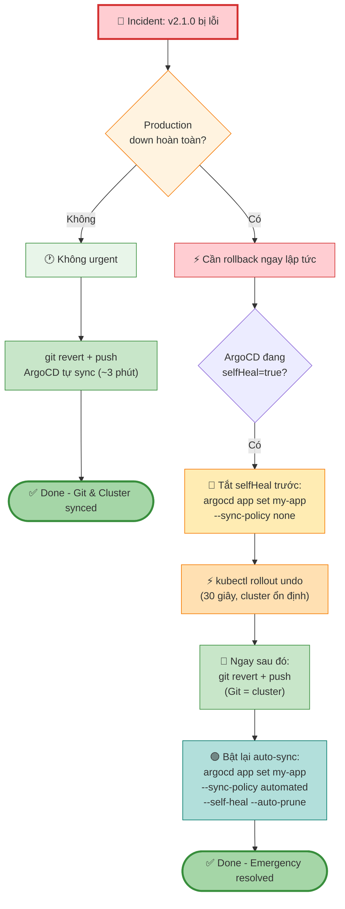
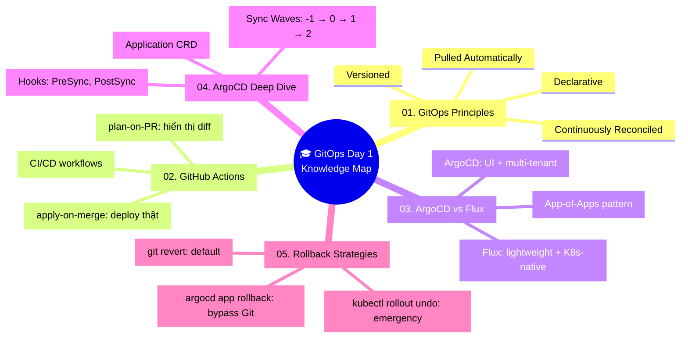

# 05 — Rollback Strategies: `git revert` vs `kubectl rollout undo`

> Đây là câu hỏi thực tế nhất khi incident xảy ra lúc 2 giờ sáng:  
> **"Tôi rollback bằng cách nào?"**

---

## Hai phương pháp rollback

### Phương pháp 1: `git revert` (GitOps way ✅)

```bash
# Scenario: commit abc1234 là deployment bị lỗi

# Xem history
git log --oneline k8s/production/
# abc1234 ci: update image tag to v2.1.0  ← ĐÂY LÀ VERSION LỖI
# def5678 ci: update image tag to v2.0.5
# ghi9012 feat: add Redis cache

# Revert commit bị lỗi (tạo 1 commit mới đảo ngược thay đổi)
git revert abc1234 --no-edit
git push origin main

# ArgoCD phát hiện commit mới → sync → cluster quay về v2.0.5
# Thời gian: ~1-3 phút (tùy ArgoCD poll interval)
```

**Tại sao đây là cách đúng trong GitOps:**
- Git history được giữ nguyên, không bị rewrite
- Có thể audit: ai revert, lúc mấy giờ, với commit message gì
- ArgoCD tự động xử lý, không cần vào cluster
- Cluster state luôn khớp với Git

---

### Phương pháp 2: `kubectl rollout undo` (bypass GitOps ⚠️)

```bash
# Rollback Deployment về revision trước đó
kubectl rollout undo deployment/my-app -n production

# Hoặc về revision cụ thể
kubectl rollout history deployment/my-app -n production
# REVISION  CHANGE-CAUSE
# 1         kubectl apply --filename=deployment.yaml
# 2         Update image to v2.0.5
# 3         Update image to v2.1.0  ← hiện tại (lỗi)

kubectl rollout undo deployment/my-app --to-revision=2 -n production
```

**Vấn đề:**
- Cluster về v2.0.5, nhưng Git vẫn còn `image: myapp:v2.1.0`
- ArgoCD thấy drift → sau 3 phút tự sync lại → **cluster quay về v2.1.0 (version lỗi)**
- Bạn vừa rollback xong thì bị deploy lại version lỗi

---

## So sánh chi tiết

| | `git revert` | `kubectl rollout undo` |
|---|---|---|
| **Tốc độ** | 1-3 phút | ~30 giây |
| **Git history** | Sạch, có audit trail | Git không biết gì |
| **Với ArgoCD selfHeal=true** | Hoạt động đúng | **BỊ OVERRIDE sau 3 phút** |
| **Khi nào dùng** | Default choice | Khi ArgoCD đã bị tắt |
| **Rollback infra (Terraform)** | Có | Không áp dụng |

---

## Khi nào dùng `argocd app rollback`?

ArgoCD có lệnh rollback riêng — rollback về 1 sync revision cụ thể **mà không cần thay đổi Git**:

```bash
# Xem sync history
argocd app history my-app
# ID  DATE                           REVISION
# 5   2024-01-15 14:32:00 +0000 UTC  abc1234 (main)  ← lỗi
# 4   2024-01-14 09:15:00 +0000 UTC  def5678 (main)  ← muốn về đây
# 3   2024-01-13 16:00:00 +0000 UTC  ghi9012 (main)

# Rollback về sync #4
argocd app rollback my-app 4
```

**Quan trọng:** `argocd app rollback` **tự động tắt automated sync**. Cluster sẽ chạy revision #4, nhưng ArgoCD sẽ không tự sync nữa.

```bash
# Sau khi resolve incident, bật lại auto-sync
argocd app set my-app \
  --sync-policy automated \
  --self-heal \
  --auto-prune

# ĐỒNG THỜI cần git revert để Git khớp với cluster
git revert abc1234 --no-edit && git push
```

---

## Quyết định rollback trong thực tế



---

## Rollback Terraform infra

Với infrastructure (Terraform), không có `rollout undo`. Cách đúng:

```bash
# Option 1: git revert (preferred)
git revert <commit-hash-terraform-change>
git push
# GitHub Actions CD chạy terraform apply với config cũ

# Option 2: terraform state + manual
# (phức tạp hơn, chỉ dùng khi git revert không khả thi)
cd infra/
git checkout <old-commit> -- main.tf
terraform plan     # xem sẽ thay đổi gì
terraform apply    # rollback infra
git checkout main -- main.tf  # restore file
git revert ...     # tạo proper commit
```

---

## Bảng quyết định nhanh

| Tình huống | Hành động |
|---|---|
| Deployment app lỗi, ArgoCD bình thường | `git revert` + push |
| Deployment lỗi, cần rollback trong 30s | Tắt selfHeal → `kubectl rollout undo` → `git revert` |
| Không biết version nào stable | `argocd app history` → `argocd app rollback <id>` |
| Terraform infra rollback | `git revert` + merge → GitHub Actions tự apply |
| Database migration rollback | Phức tạp — cần down migration script riêng |

---

## Prevent rollback failures — Best practices

**1. Tag Docker images bằng commit SHA, không phải `latest`**

```yaml
# ✅ Có thể rollback về chính xác version
image: ghcr.io/myorg/myapp:abc1234

# ❌ Không biết đang chạy version gì
image: ghcr.io/myorg/myapp:latest
```

**2. Giữ Deployment history trong K8s**

```yaml
spec:
  revisionHistoryLimit: 10   # mặc định là 10, đừng set về 0
```

**3. Test rollback định kỳ** — đừng đợi đến lúc incident mới test rollback có hoạt động không.

**4. Dùng `argocd app set --sync-policy none` thay vì sửa trực tiếp cluster** khi cần maintenance window.

---

## Tổng kết D1



---

*Bước tiếp theo: Setup lab — cài ArgoCD vào Minikube, tạo root Application, test sync và rollback.*
