# Exercise 8 — VPC + EC2 + ALB + Kubernetes Architecture Overview

> **Mục tiêu:** Deploy Node.js app trên Kubernetes (Minikube) chạy trên EC2, expose qua Application Load Balancer, provisioned hoàn toàn bằng Terraform với remote-exec automation.

---

## 1. Sơ đồ kiến trúc tổng quan

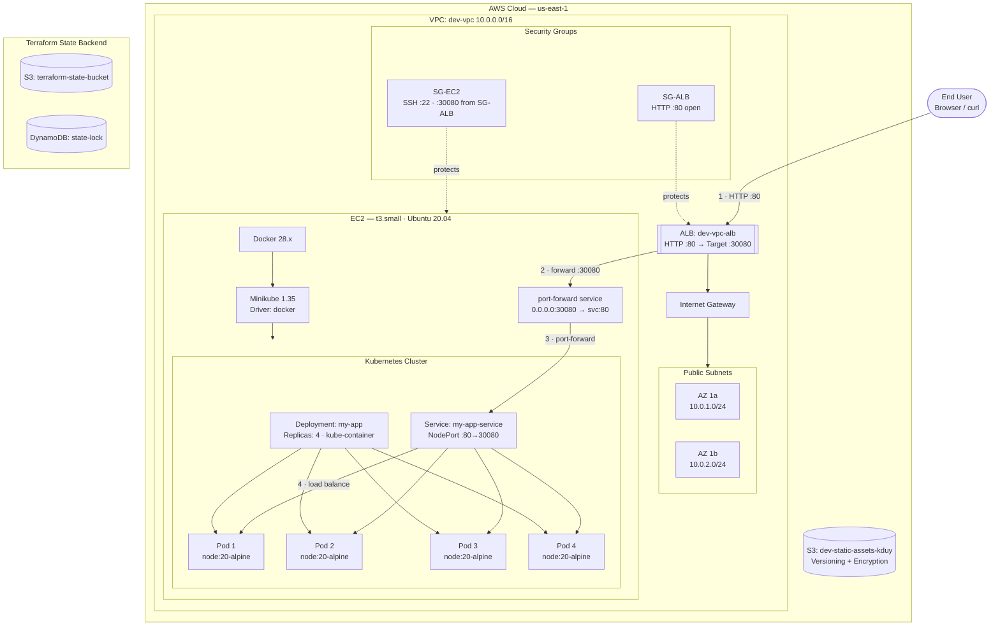

---

## 1.1. Mô tả cách thức hoạt động

Sơ đồ này mô tả một kiến trúc public entry point qua ALB, nhưng toàn bộ ứng dụng lại chạy trên một EC2 instance đóng vai trò host cho Minikube. Người dùng chỉ nhìn thấy một endpoint duy nhất là ALB; phía sau đó, ALB chuyển request vào EC2 trên cổng `30080`, rồi EC2 chuyển tiếp request vào Kubernetes Service để phân phối đến các Pod của ứng dụng.

Luồng traffic đi theo thứ tự sau:

1. Người dùng gửi HTTP request đến ALB trên port `80`.
2. ALB chỉ nhận traffic từ Internet qua Security Group `SG-ALB`, sau đó forward sang EC2 ở port `30080`.
3. Trên EC2, một service `port-forward` giữ cổng `30080` luôn lắng nghe và chuyển request vào Kubernetes Service `my-app-service`.
4. Kubernetes Service phân phối request đến một trong 4 Pod của deployment `my-app` theo cơ chế load balancing mặc định.
5. Response đi ngược lại cùng đường: Pod → Service → port-forward → EC2 → ALB → người dùng.

Về bảo mật, kiến trúc này được siết ở nhiều lớp:

- `SG-ALB` chỉ mở port `80` cho Internet, không expose thẳng EC2.
- `SG-EC2` chỉ cho phép port `30080` từ chính `SG-ALB`, nên chỉ ALB mới có thể gọi vào EC2.
- Ứng dụng không được public trực tiếp từ Pod hay Service; mọi truy cập phải đi qua ALB và EC2 forwarding.
- EC2 nằm trong public subnet để nhận traffic từ ALB, nhưng backend ứng dụng vẫn bị che bởi lớp trung gian `port-forward` và Kubernetes Service.
- Terraform state được lưu riêng trong S3 và DynamoDB để tránh mất trạng thái và đảm bảo lock khi apply.
- S3 static assets được bật versioning và encryption để bảo vệ dữ liệu tĩnh.

Nếu triển khai production, bước tăng cường tiếp theo nên là bật HTTPS trên ALB bằng ACM, giới hạn SSH bằng IP whitelist hoặc SSM Session Manager, và cân nhắc thay `port-forward` bằng một cơ chế ingress/load balancer ổn định hơn.

## 2. Request Flow Chi Tiết (End-to-End)

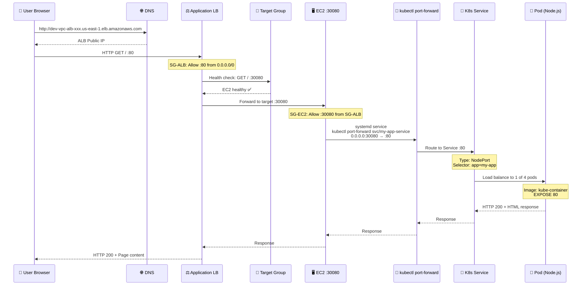

---

## 3. Luồng Traffic Chi Tiết Theo Lớp

### **Layer 1: Internet → ALB (HTTP Entry Point)**

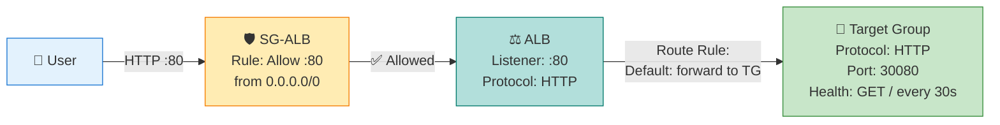

**Bảo mật Layer 1:**

- ✅ ALB public-facing → có Public IP
- ✅ SG-ALB chỉ mở port 80 (HTTP) → HTTPS nên dùng port 443 + ACM certificate
- ✅ ALB có WAF (Web Application Firewall) option (không enable trong lab)

---

### **Layer 2: ALB → EC2 (Target Group Health Check)**

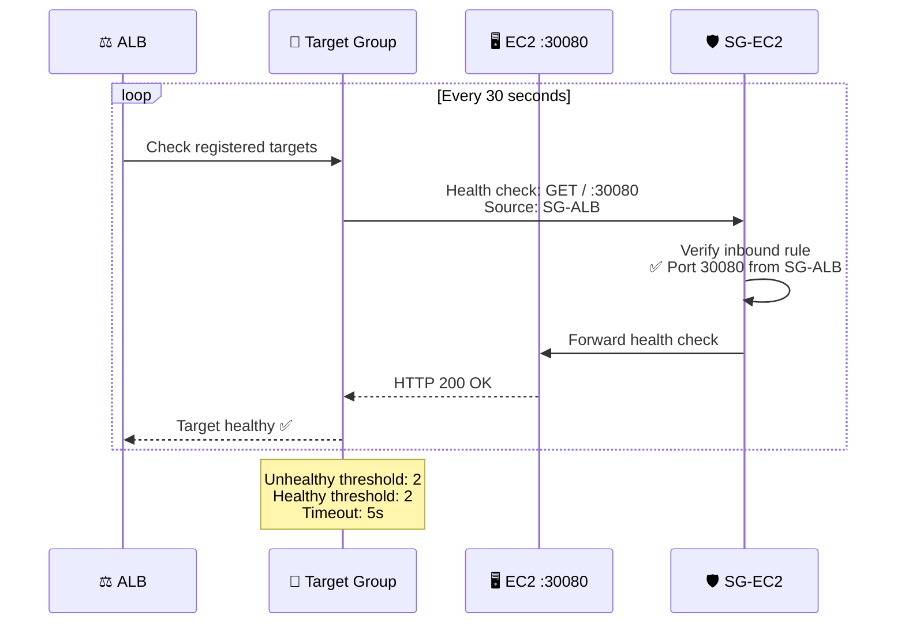

**Bảo mật Layer 2:**

- ✅ SG-EC2 chỉ nhận port 30080 từ **SG-ALB** (SG-to-SG reference)
- ✅ Không mở 30080 cho `0.0.0.0/0` → chỉ ALB mới access được

---

### **Layer 3: EC2 → Kubernetes (kubectl port-forward)**

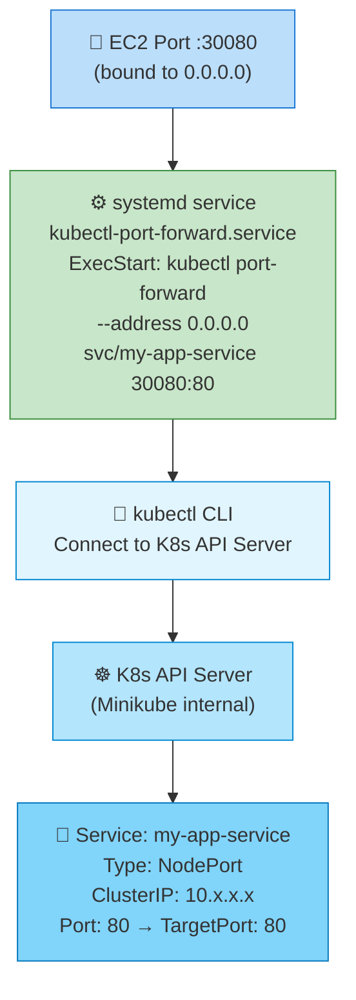

**Tại sao dùng kubectl port-forward thay vì NodePort trực tiếp?**

| Approach         | NodePort (K8s native)          | kubectl port-forward (Used in lab) |
| ---------------- | ------------------------------ | ---------------------------------- |
| **Port range**   | 30000-32767 (random)           | Any port (30080 custom)            |
| **Requires**     | Minikube tunnel / LoadBalancer | kubectl running as daemon          |
| **ALB Target**   | Không stable (port thay đổi)   | Cố định :30080                     |
| **Suitable for** | Multi-node cluster             | Single-node dev (Minikube)         |

**Bảo mật Layer 3:**

- ✅ `kubectl port-forward` chạy với user `ubuntu` (không phải root)
- ✅ systemd restart tự động nếu crash
- ⚠️ Nếu EC2 reboot → systemd auto-start

---

### **Layer 4: Kubernetes Service → Pods (Load Balancing)**

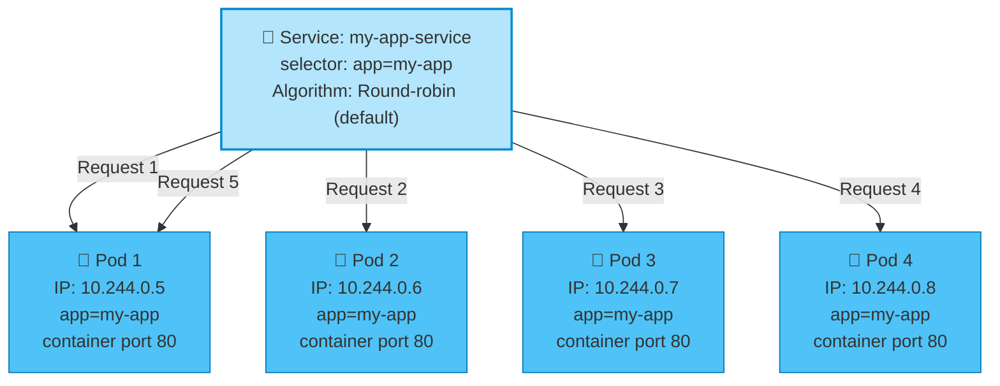

**K8s Service Configuration:**

```yaml
apiVersion: v1
kind: Service
metadata:
  name: my-app-service
spec:
  type: NodePort
  selector:
    app: my-app # Match pods with this label
  ports:
    - protocol: TCP
      port: 80 # Service port (ClusterIP)
      targetPort: 80 # Pod container port
      nodePort: 30080 # Exposed on EC2 (unused in this setup)
```

**Bảo mật Layer 4:**

- ✅ Pods isolated trong K8s network (10.244.0.0/16)
- ✅ Service chỉ route đến pods có label `app=my-app`
- ✅ Pods không có Public IP → chỉ accessible qua Service

---

## 4. Security Architecture Deep Dive

### **4.1. Security Groups Configuration**

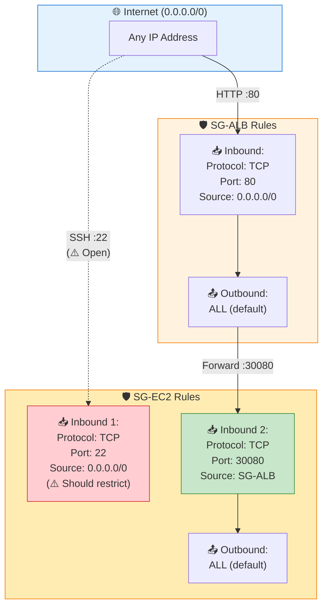

**Security Group Matrix:**

| SG Name    | Direction | Protocol | Port  | Source/Destination | Purpose                            | Security Level        |
| ---------- | --------- | -------- | ----- | ------------------ | ---------------------------------- | --------------------- |
| **SG-ALB** | Inbound   | TCP      | 80    | 0.0.0.0/0          | Public HTTP access                 | ✅ Expected           |
| **SG-ALB** | Outbound  | ALL      | ALL   | 0.0.0.0/0          | Response + health checks           | ✅ Stateful           |
| **SG-EC2** | Inbound   | TCP      | 22    | 0.0.0.0/0          | SSH admin access                   | ⚠️ **HIGH RISK**      |
| **SG-EC2** | Inbound   | TCP      | 30080 | **SG-ALB**         | ALB → EC2 traffic                  | ✅ Secured (SG-to-SG) |
| **SG-EC2** | Outbound  | ALL      | ALL   | 0.0.0.0/0          | Internet access (apt, docker pull) | ✅ Required           |

---

### **4.2. Threat Model & Mitigation**

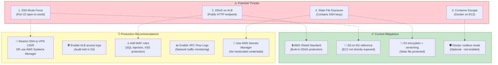

---

### **4.3. Terraform Provisioning Security**

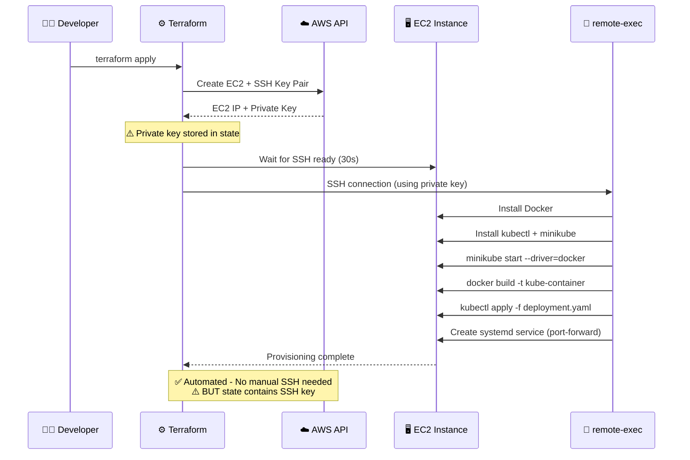

**Security Concerns:**

- ⚠️ **remote-exec** requires SSH key → stored in Terraform state (S3)
- ⚠️ State file = sensitive data → MUST enable S3 encryption
- ✅ **Mitigation:** S3 bucket versioning + encryption + restricted IAM access

---

## 5. Terraform Modules & Dependency Graph

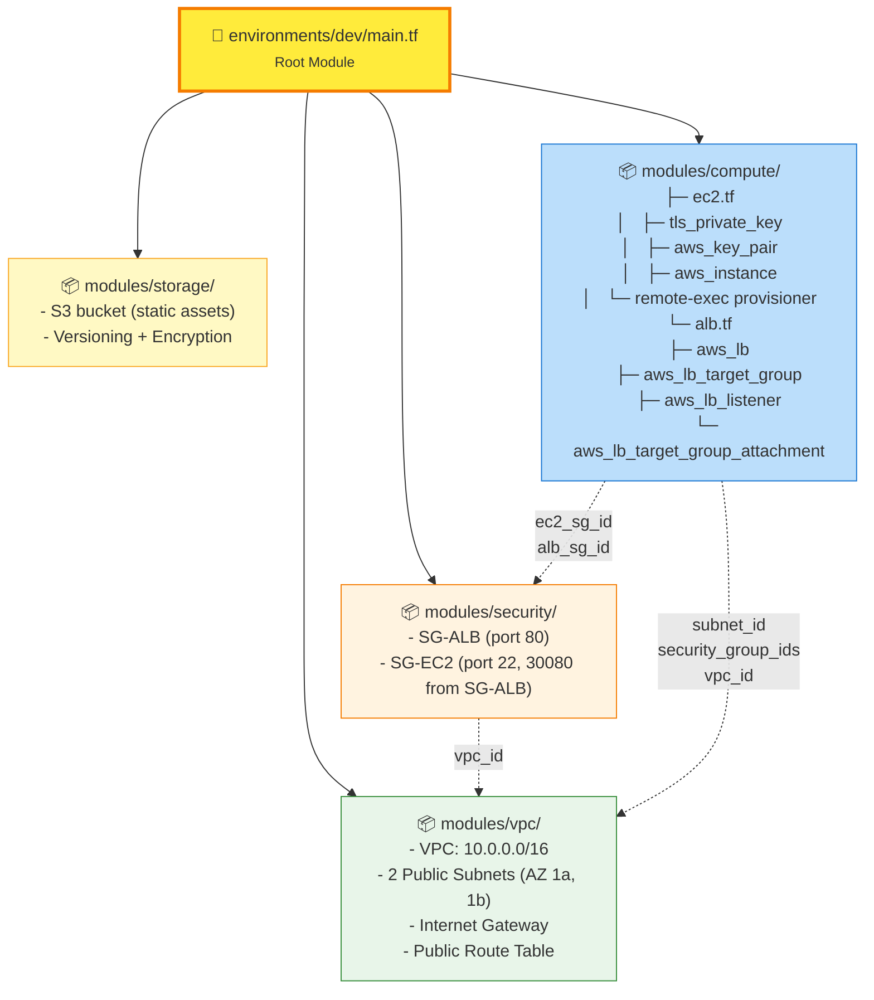

**Deployment Order:**

1. **VPC Module** → Network foundation (VPC, subnets, IGW)
2. **Security Module** → Security Groups (depends on vpc_id)
3. **Storage Module** → S3 bucket (independent)
4. **Compute Module** → EC2 + ALB (depends on VPC + Security)

**Critical Dependencies:**

- ALB needs **2 subnets** in different AZs (HA requirement)
- EC2 needs **subnet_id** + **security_group_id**
- Target Group attachment needs **EC2 instance_id**

---

## 6. Lifecycle & Destroy Flow

### **6.1. Normal Destroy (Ideal Case)**

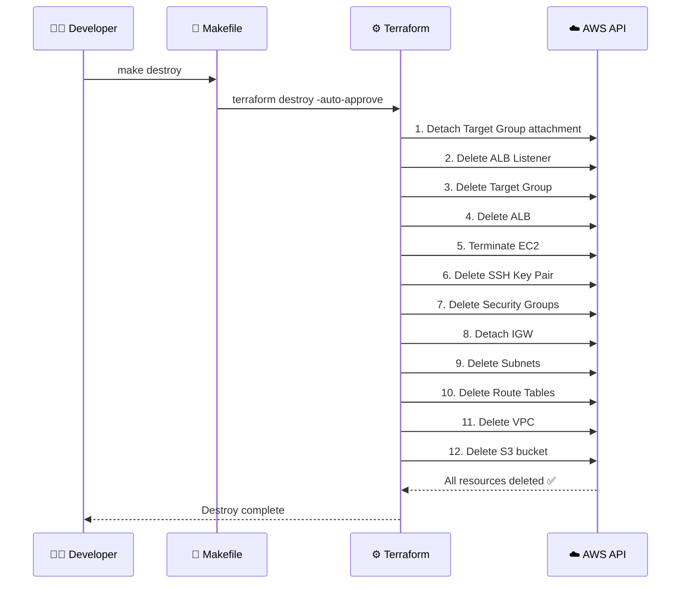

---

### **6.2. Problematic Destroy (ENI Leak Issue)**

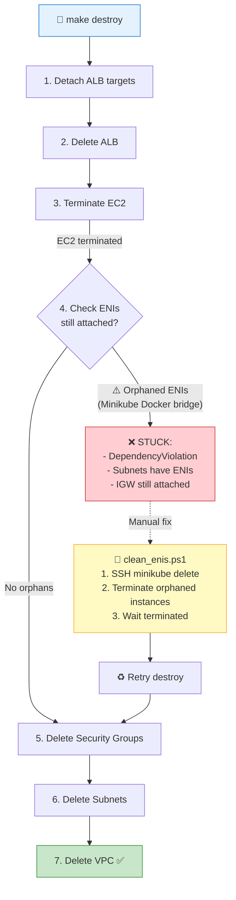

**Nguyên nhân ENI leak:**

- Minikube tạo Docker bridge network → attach ENI vào VPC
- Khi EC2 bị terminate đột ngột → ENI không được cleanup
- Terraform không track ENI này → không xóa tự động

**Giải pháp:** Pre-destroy script

---

### **6.3. Pre-Destroy Script Workflow**

```powershell
# scripts/pre_destroy.ps1
$VPC_ID = terraform -chdir=environments/dev output -raw vpc_id
pwsh -File scripts/clean_enis.ps1 -VpcId $VPC_ID
```

```powershell
# scripts/clean_enis.ps1
1. SSH vào EC2: `minikube delete` (graceful cleanup)
2. Query orphaned EC2 instances trong VPC
3. Terminate orphaned instances
4. Wait instance-terminated (polling)
5. Return success → Terraform destroy tiếp
```

---

## 7. Application Architecture (Node.js + Docker + K8s)

### **7.1. Container Build & Deploy Flow**

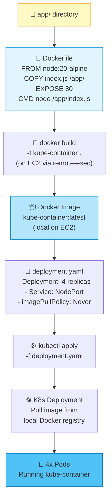

**Key Point:** `imagePullPolicy: Never`

- Image được build local trên EC2
- K8s không pull từ Docker Hub / ECR
- Phù hợp cho dev/lab (production nên dùng registry)

---

### **7.2. Node.js Application Code**

```javascript
// app/index.js
const http = require("http");
const os = require("os");

const PORT = 80;
const HOSTNAME = os.hostname();

const server = http.createServer((req, res) => {
  res.statusCode = 200;
  res.setHeader("Content-Type", "text/html");
  res.end(`
    <h1>🚀 Hello from Kubernetes!</h1>
    <p>Pod: <strong>${HOSTNAME}</strong></p>
    <p>Request path: ${req.url}</p>
  `);
});

server.listen(PORT, "0.0.0.0", () => {
  console.log(`Server running at http://0.0.0.0:${PORT}/`);
});
```

**Features:**

- Hiển thị Pod hostname → verify load balancing works
- Listen `0.0.0.0` → accessible from K8s Service
- Port 80 → standard HTTP (không cần :8080)

---

## 8. High Availability Analysis

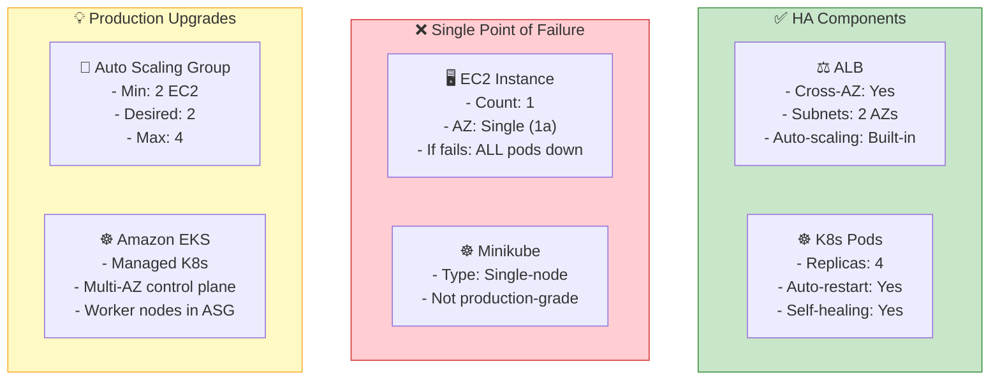

**Current Setup:**

- ✅ ALB is HA (cross-AZ)
- ✅ Pods have replicas (4x)
- ❌ EC2 is single instance → SPOF
- ❌ Minikube is dev tool → not for production

**Production Path:**

1. Replace Minikube with **Amazon EKS** (managed K8s)
2. Deploy EC2 workers in **Auto Scaling Group** (2+ AZs)
3. Use **EKS Fargate** for serverless pods (optional)

---

## 9. Cost Analysis

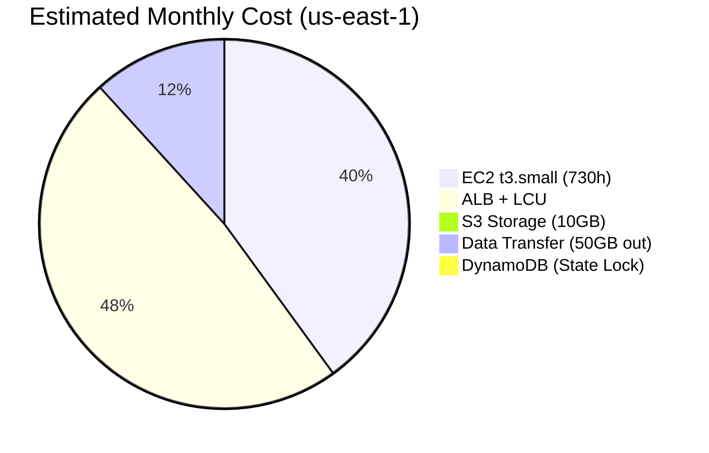

**Total:** ~$38.81/month

**Cost Breakdown:**
| Resource | Pricing | Monthly |
|---|---|---|
| EC2 t3.small | $0.021/hour | $15.33 |
| ALB (fixed) | $0.025/hour | $18.25 |
| ALB LCU | $0.008/LCU-hour | ~$0.25 (low traffic) |
| S3 Standard | $0.023/GB | $0.23 (10GB) |
| DynamoDB On-Demand | $1.25/million writes | $0.25 (state locks) |
| Data Transfer Out | $0.09/GB | $4.50 (50GB) |

**Cost Optimization Tips:**

- ✅ Use **t3.small** (burstable) thay vì t3.medium
- ⚠️ ALB cost cố định $18/tháng → đắt cho lab (cân nhắc dùng EC2 Public IP)
- ✅ Stop EC2 khi không dùng → chỉ trả S3 + DynamoDB
- ✅ S3 Lifecycle policy: xóa old versions sau 30 days

**For Lab/Dev:**

```bash
# Stop EC2 khi không dùng
aws ec2 stop-instances --instance-ids <id>

# Start lại khi cần
aws ec2 start-instances --instance-ids <id>
```

---

## 10. Monitoring & Observability

### **10.1. CloudWatch Metrics**

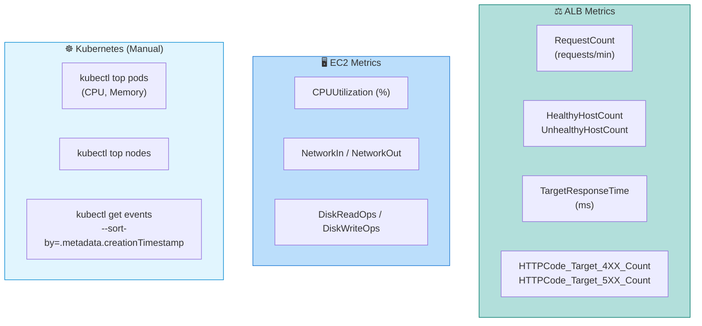

**Recommended Alarms:**

- ⚠️ ALB `UnhealthyHostCount > 0` → EC2 health check failing
- ⚠️ EC2 `CPUUtilization > 80%` → consider scaling
- ⚠️ ALB `HTTPCode_Target_5XX_Count > 10` → application errors

---

### **10.2. Logging Strategy**

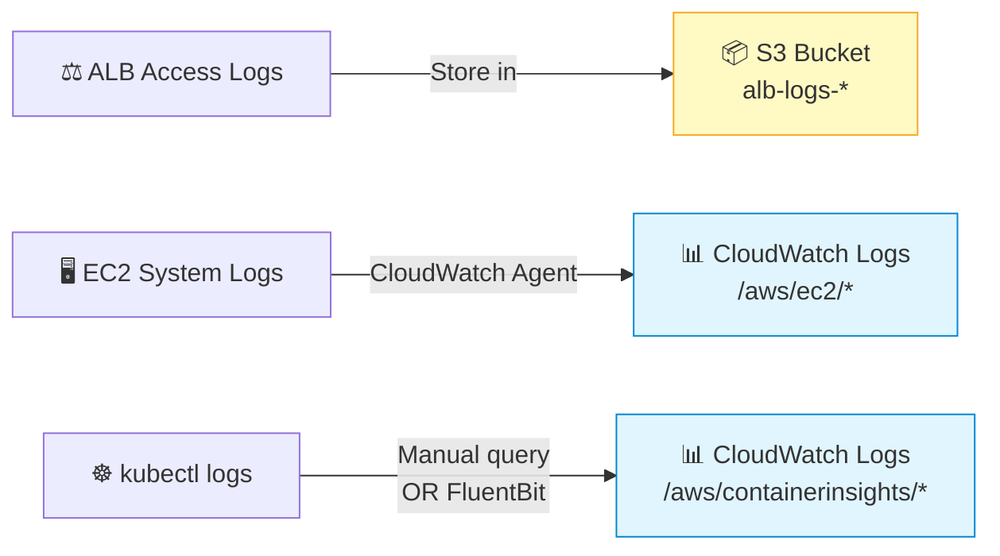

**Enable ALB Access Logs:**

```terraform
resource "aws_lb" "main" {
  # ...

  access_logs {
    bucket  = aws_s3_bucket.alb_logs.id
    enabled = true
  }
}
```

---

## 11. Troubleshooting Guide

### **Issue 1: ALB returns 502 Bad Gateway**

**Symptoms:**

- Browser shows "502 Bad Gateway"
- ALB health check failing

**Debug Steps:**

```bash
# 1. Check Target Group health
aws elbv2 describe-target-health \
  --target-group-arn <arn>

# 2. SSH vào EC2, test port 30080
curl http://localhost:30080

# 3. Check kubectl port-forward running
systemctl status kubectl-port-forward

# 4. Check K8s pods
kubectl get pods
kubectl logs <pod-name>
```

**Common Fixes:**

- ✅ Restart port-forward: `systemctl restart kubectl-port-forward`
- ✅ Verify SG-EC2 allows :30080 from SG-ALB
- ✅ Check pods are Running: `kubectl get pods`

---

### **Issue 2: Terraform destroy stuck on VPC**

**Symptoms:**

```
Error: DependencyViolation: Network interface is currently in use
Error: DependencyViolation: The vpc 'vpc-xxx' has dependencies
```

**Solution:**

```bash
# Run pre-destroy script
make clean-enis VPC_ID=<vpc-id>

# Then retry
make destroy
```

---

### **Issue 3: EC2 không SSH được**

**Symptoms:** `Permission denied (publickey)` hoặc timeout

**Debug:**

```bash
# 1. Check SG-EC2 allows :22
aws ec2 describe-security-groups --group-ids <sg-id>

# 2. Verify EC2 có Public IP
aws ec2 describe-instances --instance-ids <id> \
  --query 'Reservations[0].Instances[0].PublicIpAddress'

# 3. Test SSH với verbose
ssh -vvv -i ec2_key.pem ubuntu@<public-ip>
```

---

## 12. Security Hardening Checklist

### **Before Production Deployment:**

#### **Network Security:**

- [ ] **SSH Access:** Restrict SG-EC2 port 22 to VPN CIDR or remove entirely (use AWS Systems Manager Session Manager)
- [ ] **HTTPS:** Replace ALB HTTP :80 listener with HTTPS :443 + ACM certificate
- [ ] **WAF:** Attach AWS WAF to ALB with rules for SQL injection, XSS, rate limiting
- [ ] **VPC Flow Logs:** Enable to capture all network traffic for audit
- [ ] **NAT Gateway:** Add if private resources need Internet (updates, Docker pulls)

#### **Compute Security:**

- [ ] **IAM Role:** Attach IAM role to EC2 instead of using AWS access keys
- [ ] **AMI Hardening:** Use CIS-hardened AMI or apply security benchmarks
- [ ] **Patch Management:** Enable AWS Systems Manager Patch Manager
- [ ] **Immutable Infrastructure:** Use Auto Scaling Group + Launch Template, không SSH vào EC2
- [ ] **Secrets Management:** Use AWS Secrets Manager cho DB passwords, API keys

#### **Container Security:**

- [ ] **Image Scanning:** Scan Docker images với Amazon ECR image scanning
- [ ] **Least Privilege:** Container chạy với non-root user
- [ ] **Network Policies:** Implement K8s Network Policies để isolate pods
- [ ] **Pod Security Standards:** Apply `restricted` PSS profile
- [ ] **Registry:** Push images lên private ECR, không dùng `imagePullPolicy: Never`

#### **Data Security:**

- [ ] **Encryption at Rest:** Enable EBS encryption cho EC2 volumes
- [ ] **Encryption in Transit:** TLS/HTTPS end-to-end
- [ ] **S3 Bucket Policies:** Restrict access to VPC Endpoints only
- [ ] **State File:** Rotate Terraform state encryption keys

#### **Monitoring & Incident Response:**

- [ ] **CloudWatch Alarms:** CPU, Memory, Disk, ALB 5xx errors
- [ ] **SNS Notifications:** Alert team when alarms trigger
- [ ] **AWS GuardDuty:** Enable threat detection
- [ ] **AWS Config:** Track compliance with security baselines
- [ ] **Backup Strategy:** Automated AMI snapshots, RDS backups (nếu có DB)

---

## 13. Comparison: Lab 1 vs Exercise 8

| Aspect            | Lab 1 (VPC+EC2+S3+RDS)                   | Exercise 8 (VPC+EC2+ALB+K8s)             |
| ----------------- | ---------------------------------------- | ---------------------------------------- |
| **Focus**         | 3-tier architecture<br/>(Web → App → DB) | Containerized app<br/>(ALB → K8s → Pods) |
| **Load Balancer** | ❌ None (EC2 direct access)              | ✅ ALB (HTTP load balancing)             |
| **Database**      | ✅ RDS MySQL (private subnet)            | ❌ None                                  |
| **Orchestration** | ❌ None                                  | ✅ Kubernetes (Minikube)                 |
| **Container**     | ❌ None                                  | ✅ Docker + K8s Pods (4 replicas)        |
| **Provisioning**  | Manual EC2 setup                         | ✅ Automated (remote-exec)               |
| **Availability**  | Single EC2 + RDS Multi-AZ                | Single EC2 + ALB Multi-AZ                |
| **Security**      | SG-to-SG (EC2 → RDS)                     | SG-to-SG (ALB → EC2)                     |
| **Cost**          | ~$31/month                               | ~$39/month (ALB adds $18)                |
| **Use Case**      | Traditional app + database               | Modern microservices                     |

**Learning Progression:**

1. **Lab 1:** Foundation networking + database integration
2. **Exercise 8:** Containerization + orchestration + load balancing
3. **Next Step:** Multi-AZ EKS cluster + RDS + CI/CD pipeline

---

## 14. Architecture Evolution Path

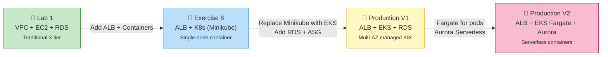

---

## Kết luận

Exercise 8 nâng cấp từ Lab 1 với:

- ✅ **Load Balancer (ALB)** thay vì EC2 direct access → better scalability
- ✅ **Kubernetes** orchestration → container management, self-healing
- ✅ **Automated provisioning** (remote-exec) → infrastructure as code hoàn chỉnh
- ✅ **Multi-replica pods** → availability trong single node

**Điểm mạnh:**

- ALB cross-AZ → HA cho load balancing
- K8s Service → load balance across pods
- Docker containerization → portable, reproducible
- Terraform modules → reusable, maintainable

**Limitations:**

- Single EC2 → SPOF (production cần ASG)
- Minikube → dev tool (production cần EKS)
- SSH open to world → security risk

**Next Steps:**

- Implement CI/CD pipeline (GitHub Actions → ECR → EKS)
- Add monitoring (Prometheus + Grafana)
- Harden security (WAF, VPN, Secrets Manager)
- Migrate to EKS + Fargate

---

_Previous: [Lab 1 - Architecture Overview](../../cloud/w8/lab1-VPC+EC2+S3+RDS/ARCHITECTURE_OVERVIEW.md)_
