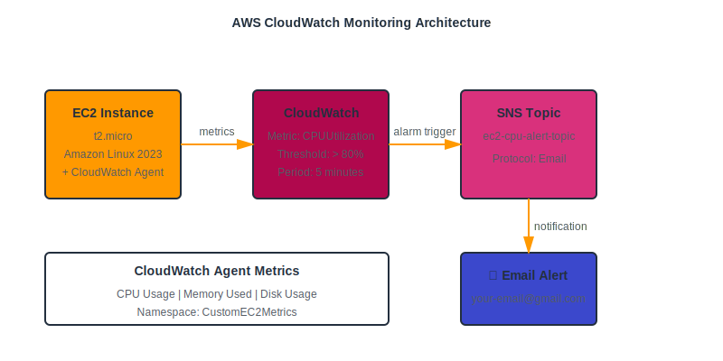
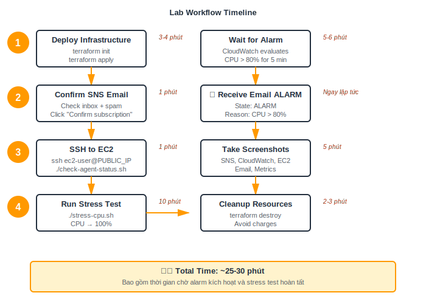

# 📊 Lab: CloudWatch Alarm + SNS Email Alert

> Tự động gửi email cảnh báo khi EC2 CPU vượt 80% trong 5 phút

## 🎯 Mục tiêu

- Tạo EC2 instance với CloudWatch Agent
- Thiết lập CloudWatch Alarm giám sát CPU
- Cấu hình SNS gửi email khi alarm kích hoạt
- Thu thập custom metrics (CPU, Memory, Disk)

---

## 🏗️ Kiến trúc



**Thành phần:**
- **EC2 t2.micro** - Amazon Linux 2023 + CloudWatch Agent
- **CloudWatch Alarm** - Monitor CPU > 80% trong 5 phút
- **SNS Topic** - Gửi notification qua email
- **IAM Role** - Quyền cho EC2 gửi metrics về CloudWatch

---

## 🚀 Triển khai nhanh

### 1. Cấu hình email

Mở file `variables.tf` và sửa email:

```hcl
variable "alert_email" {
  default = "your-email@gmail.com"  # ← Sửa email
}
```

### 2. Deploy

```bash
cd monitoring/lab1

terraform init
terraform apply -auto-approve
```

⏱️ **Thời gian:** 3-4 phút

### 3. Confirm email

1. Mở email (check cả spam!)
2. Tìm "AWS Notification - Subscription Confirmation"
3. Click "Confirm subscription"

### 4. Kiểm tra CloudWatch Agent

```bash
# Lấy Public IP
terraform output ec2_public_ip

# SSH vào EC2
ssh ec2-user@<PUBLIC_IP>

# Kiểm tra agent status
./check-agent-status.sh
```

### 5. Chạy stress test

```bash
./stress-cpu.sh
```

**Timeline:**
- ⏱️ **Phút 0-5:** CPU tăng lên 100%
- 🚨 **Phút 5-6:** CloudWatch Alarm kích hoạt
- 📧 **Phút 6:** Nhận email ALARM
- ⏱️ **Phút 10:** Stress test dừng
- 📧 **Phút 15-16:** Nhận email OK

---

## 📸 Evidence Screenshots

Chụp ảnh các màn hình sau:

### AWS Console

| Dịch vụ | Màn hình | Nội dung |
|---------|----------|----------|
| **SNS** | Topics | Topic name + ARN |
| **SNS** | Subscriptions | Status = **Confirmed** ✅ |
| **CloudWatch** | Alarms | State = **In alarm** 🔴 |
| **CloudWatch** | Alarm Graph | CPU > 80% (vượt threshold) |
| **CloudWatch** | Metrics | CustomEC2Metrics namespace |
| **EC2** | Instances | Instance running |
| **EC2** | Monitoring | CPU spike graph |
| **IAM** | Role | EC2-CloudWatch-Agent-Role |

### Email

- ✅ Confirmation email
- ✅ ALARM notification (CPU > 80%)
- ✅ OK notification (CPU normal)

---

## 📊 Workflow Timeline



---

## 🧪 Custom Metrics

CloudWatch Agent thu thập:

| Metric | Namespace | Mô tả |
|--------|-----------|-------|
| `CPU_IDLE` | CustomEC2Metrics | % CPU idle |
| `CPU_IOWAIT` | CustomEC2Metrics | % CPU waiting for I/O |
| `MEM_USED` | CustomEC2Metrics | % Memory sử dụng |
| `DISK_USED` | CustomEC2Metrics | % Disk sử dụng |

**Xem custom metrics:**
- CloudWatch Console → Metrics → CustomEC2Metrics

---

## 🧹 Dọn dẹp

```bash
terraform destroy -auto-approve
```

⏱️ **Thời gian:** 2-3 phút

---

## 💡 Lưu ý

- ⚠️ **Phải confirm email** - Không confirm = không nhận cảnh báo
- ⏱️ **Đợi 6-7 phút** - CloudWatch cần thời gian aggregate metrics
- 📧 **Check spam folder** - Email SNS thường bị spam
- 🧹 **Destroy sau khi chụp ảnh** - Tránh bị tính phí
- 🔑 **Session Manager** - Không cần SSH key, dùng IAM role

---

## 💰 Chi phí

| Dịch vụ | Chi phí |
|---------|---------|
| EC2 t2.micro | FREE (750h/tháng) |
| CloudWatch Alarm | $0.10/alarm (10 alarms free) |
| SNS Email | FREE (1000 emails/tháng) |
| CloudWatch Agent | FREE |
| **TỔNG** | **$0** (trong Free Tier) |

---

## 📚 Resources

- **Terraform files:** `main.tf`, `variables.tf`, `terraform.tfvars`
- **Scripts on EC2:**
  - `stress-cpu.sh` - Chạy stress test
  - `check-agent-status.sh` - Kiểm tra CloudWatch Agent
- **IAM Policies:**
  - `CloudWatchAgentServerPolicy` - Gửi metrics
  - `AmazonSSMManagedInstanceCore` - Session Manager

---

**🎉 Hoàn thành lab trong ~25-30 phút**
