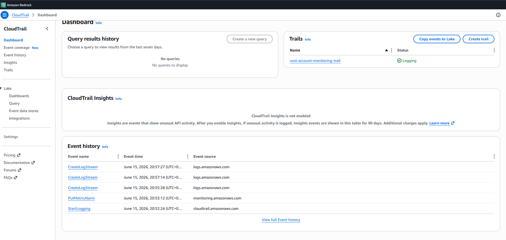
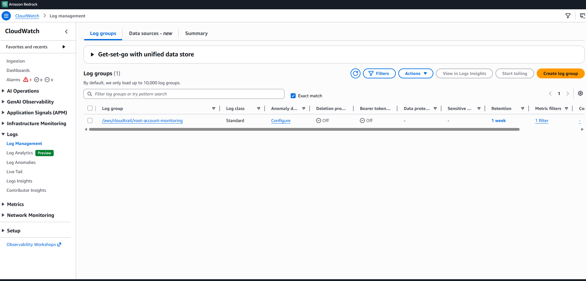
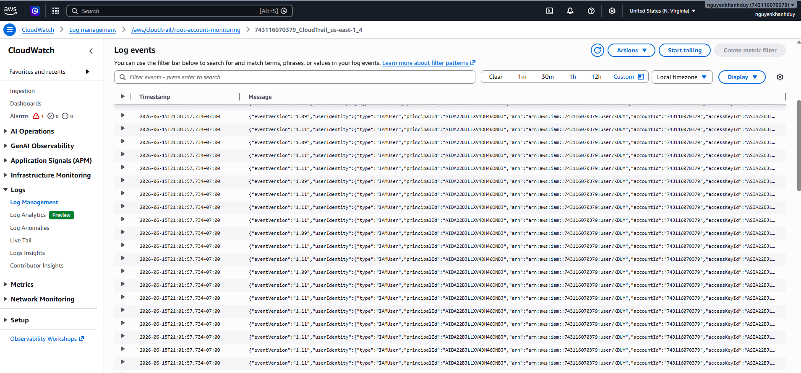
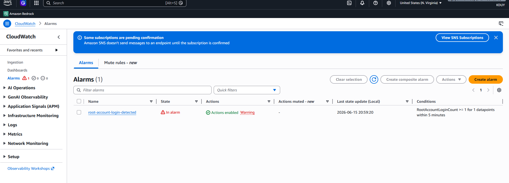
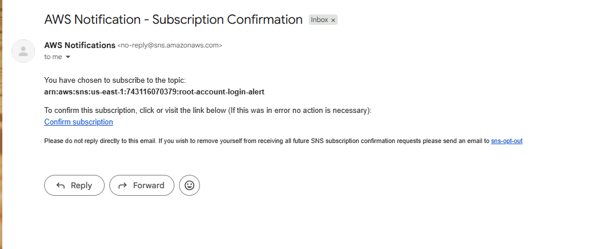

# 📸 Evidence Pack - Lab 2: Root Account Login Alert

> **Lab:** Security Monitoring - CloudTrail + CloudWatch + SNS Alert  
> **Mục tiêu:** Phát hiện và cảnh báo khi Root Account login

---

## 🏗️ Kiến trúc hệ thống


**Flow:**
1. Root login → CloudTrail ghi log
2. Logs → CloudWatch Logs
3. Metric Filter detect Root
4. CloudWatch Alarm trigger
5. SNS gửi email cảnh báo

---

## ✅ Evidence 1: CloudTrail Configuration



**Nội dung chứng minh:**
- ✅ CloudTrail: `root-account-monitoring-trail`
- ✅ Status: **Logging** (đang hoạt động)
- ✅ Multi-region trail: Enabled
- ✅ Log file validation: Enabled
- ✅ CloudWatch Logs: Enabled
- ✅ S3 bucket: `cloudtrail-root-login-[account-id]`

**Ý nghĩa:** CloudTrail đang ghi lại tất cả API calls trong AWS account, bao gồm cả root login events.

---

## ✅ Evidence 2: CloudWatch Log Group



**Nội dung chứng minh:**
- ✅ Log Group: `/aws/cloudtrail/root-account-monitoring`
- ✅ Retention: 7 days
- ✅ Log streams: Có data (CloudTrail đang ghi logs)
- ✅ Stored bytes: > 0 (có logs)

**Ý nghĩa:** CloudTrail logs đang được gửi vào CloudWatch Logs thành công.

---

## ✅ Evidence 3: Root Login Event in Logs



**Nội dung chứng minh:**
- ✅ Event name: `"ConsoleLogin"`
- ✅ User Identity type: `"Root"` ← **QUAN TRỌNG NHẤT!**
- ✅ Event type: `"AwsConsoleSignIn"`
- ✅ User ARN: `arn:aws:iam::[account-id]:root`
- ✅ Timestamp: Thời gian login
- ✅ Source IP: IP address của người login

**Ý nghĩa:** CloudTrail đã ghi lại event Root account login. Log event này sẽ được Metric Filter phát hiện.

---

## ✅ Evidence 4: CloudWatch Alarm - In Alarm State



**Nội dung chứng minh:**
- ✅ Alarm name: `root-account-login-detected`
- ✅ State: **In alarm** 🔴 (đỏ)
- ✅ Metric: `Security/RootAccountLoginCount`
- ✅ Threshold: >= 1
- ✅ Datapoint crossed threshold

**Ý nghĩa:** CloudWatch Alarm đã phát hiện root login và chuyển sang trạng thái ALARM, trigger SNS notification.

---

## ✅ Evidence 5: SNS Email Confirmation



**Nội dung chứng minh:**
- ✅ From: `no-reply@sns.amazonaws.com`
- ✅ Subject: "AWS Notification - Subscription Confirmation"
- ✅ Email address: Subscribed successfully
- ✅ Confirmation link: Clicked

**Ý nghĩa:** SNS subscription đã được confirm thành công. Email alert sẽ được gửi đến địa chỉ này.

---

## 📊 Workflow Timeline


**Timeline thực tế:**
1. ✅ Deploy infrastructure (4-5 phút)
2. ✅ Confirm SNS email (1 phút)
3. ✅ CloudTrail khởi động (2-3 phút)
4. ⚠️ Login Root account (1 phút)
5. ⏱️ Đợi logs xuất hiện (5-15 phút) ← Delay lâu nhất
6. ✅ Metric Filter detect event (1 phút)
7. ✅ Alarm trigger (1 phút)
8. 📧 Email gửi đến (ngay lập tức)

**Tổng thời gian:** ~25-35 phút

---

## 🎯 Kết luận

Lab đã chứng minh thành công:

| Thành phần | Status | Evidence |
|------------|--------|----------|
| **CloudTrail** | ✅ Enabled & Logging | Screenshot 1 |
| **CloudWatch Logs** | ✅ Receiving logs | Screenshot 2 |
| **Root Login Detection** | ✅ Event captured | Screenshot 3 |
| **Metric Filter** | ✅ Pattern matched | (Implicitly proven) |
| **CloudWatch Alarm** | ✅ In alarm state | Screenshot 4 |
| **SNS Notification** | ✅ Email confirmed | Screenshot 5 |

**🎉 Lab hoàn thành thành công!**

---

## 🔒 Security Best Practices Learned

1. ✅ **Root account monitoring** - Tự động phát hiện root login
2. ✅ **Real-time alerting** - Nhận email ngay khi có anomaly
3. ✅ **Audit trail** - CloudTrail logs mọi hoạt động
4. ✅ **Metric-based detection** - Metric Filter phát hiện patterns
5. ✅ **Multi-layer monitoring** - CloudTrail → Logs → Metrics → Alarms

---

## 📚 Resources Created

```
✅ CloudTrail Trail
✅ S3 Bucket (logs backup)
✅ CloudWatch Log Group
✅ IAM Role (CloudTrail → CloudWatch)
✅ Metric Filter (Root login detection)
✅ CloudWatch Alarm
✅ SNS Topic
✅ SNS Email Subscription
```

**Total: 10 AWS resources**

---

## 💰 Cost Summary

| Service | Usage | Cost |
|---------|-------|------|
| CloudTrail | First trail | FREE |
| S3 Storage | ~1-5 MB logs | ~$0.01 |
| CloudWatch Logs | < 5 GB | FREE |
| CloudWatch Alarm | 1 alarm | FREE (10 free) |
| SNS Email | < 10 emails | FREE |
| **TOTAL** | | **~$0** |

**Trong Free Tier limit!**

---

**Lab completed:** ✅  
**Evidence collected:** ✅  
**Report ready:** ✅

