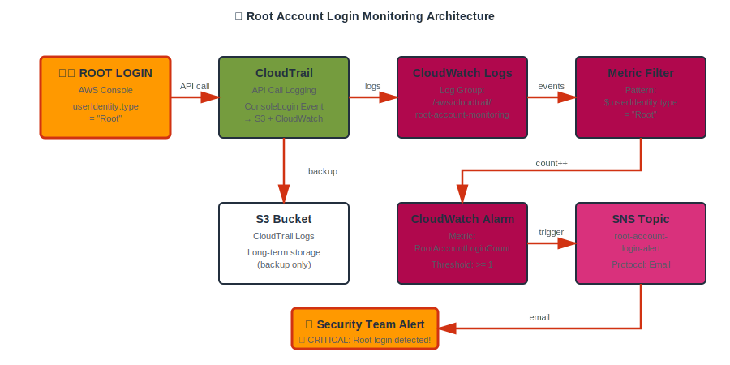
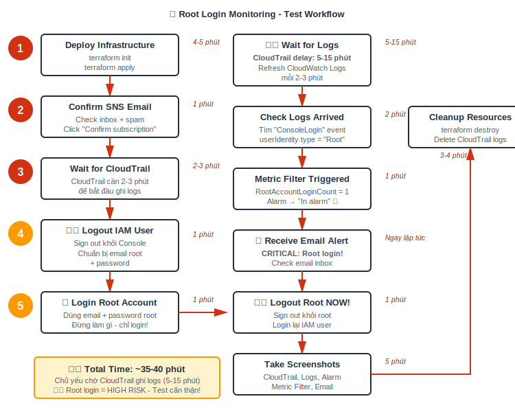

# 🚨 Lab 2: Root Account Login Alert

> **Security Best Practice:** Root account không nên được sử dụng. Cảnh báo ngay lập tức khi phát hiện root login!

## 🎯 Mục tiêu

- Enable CloudTrail để ghi lại tất cả API calls
- Gửi CloudTrail logs vào CloudWatch Logs
- Tạo Metric Filter phát hiện root account login
- Thiết lập CloudWatch Alarm kích hoạt khi root login
- Gửi email cảnh báo critical qua SNS

---

## 🏗️ Kiến trúc



**Flow:**
1. User login root → AWS Console
2. CloudTrail ghi log "ConsoleLogin" event
3. Logs được gửi đến CloudWatch Logs
4. Metric Filter detect `userIdentity.type = "Root"`
5. CloudWatch Alarm kích hoạt (threshold >= 1)
6. SNS gửi email cảnh báo CRITICAL

---

## ⚠️ LƯU Ý QUAN TRỌNG

### 🔴 RỦI RO CAO
- **Root account có FULL quyền** trong AWS
- Test lab này yêu cầu login root **thật**
- Phải **logout ngay** sau khi test
- **Enable MFA** cho root trước khi test

### ⏱️ THỜI GIAN CHỜ
- CloudTrail có **delay 5-15 phút** để ghi logs
- Không real-time như EC2 metrics
- Phải **kiên nhẫn** khi test

---

## 🚀 Triển khai

### 1. Cấu hình email

```bash
cd monitoring/lab2
```

Sửa file `variables.tf`:
```hcl
variable "alert_email" {
  default = "your-email@gmail.com"  # ← Sửa email
}
```

### 2. Deploy

```bash
terraform init
terraform apply -auto-approve
```

⏱️ **Thời gian:** 4-5 phút

**Resources được tạo:**
- ✅ CloudTrail (multi-region)
- ✅ S3 bucket (chứa logs backup)
- ✅ CloudWatch Log Group
- ✅ IAM Role (CloudTrail → CloudWatch)
- ✅ Metric Filter (phát hiện root login)
- ✅ CloudWatch Alarm
- ✅ SNS Topic + Email subscription

### 3. Confirm email

📧 Check email (kể cả spam) → Click "Confirm subscription"

### 4. Đợi CloudTrail khởi động

⏱️ **Đợi 2-3 phút** sau `terraform apply` để CloudTrail bắt đầu ghi logs.

---

## 🧪 Testing (QUAN TRỌNG!)

### ⚠️ Chuẩn bị trước khi test

1. **Backup thông tin root:**
   - Email root account
   - Password root
   - MFA device (nếu có)

2. **Enable MFA cho root** (recommended):
   - AWS Console → Security Credentials → MFA

3. **Lưu IAM user credentials:**
   - Để login lại sau khi test

---

### 🔐 Các bước test

#### **Bước 1: Logout khỏi IAM user**
```
AWS Console → User menu → Sign out
```

#### **Bước 2: Login vào Root Account**
```
1. Đi đến: https://console.aws.amazon.com/
2. Click "Sign in" → "Root user"
3. Nhập email root + password
4. (Nếu có MFA: nhập MFA code)
5. ⚠️ Login xong → ĐỪNG LÀM GÌ CẢ
```

#### **Bước 3: Đợi logs xuất hiện**
⏱️ **Đợi 5-15 phút** (CloudTrail delay)

Trong lúc đợi, bạn có thể:
- Mở tab khác → Login lại bằng IAM user
- Check CloudWatch Logs mỗi 2-3 phút

**Kiểm tra logs:**
```
AWS Console (IAM user) → CloudWatch → Log groups
→ /aws/cloudtrail/root-account-monitoring
→ Tìm event có:
   - eventName: "ConsoleLogin"
   - userIdentity.type: "Root"
```

#### **Bước 4: Check Metric Filter**
```
CloudWatch → Log groups → Metric filters
→ RootAccountLoginFilter
→ Tab "Metric data" → Xem có datapoint nào không
```

#### **Bước 5: Check Alarm**
```
CloudWatch → Alarms → root-account-login-detected
→ State phải là "In alarm" 🔴
```

#### **Bước 6: Check Email**
📧 Bạn sẽ nhận email với subject:
```
ALARM: "root-account-login-detected" in...
```

#### **Bước 7: ⚠️ LOGOUT ROOT NGAY!**
```
AWS Console (Root session) → Sign out
```

---

## 📸 Evidence Screenshots

| # | Màn hình | Nội dung cần thấy |
|---|----------|-------------------|
| 1 | **CloudTrail** | Trail enabled, logging |
| 2 | **S3 Bucket** | CloudTrail logs đang được ghi |
| 3 | **CloudWatch Log Group** | /aws/cloudtrail/root-account-monitoring |
| 4 | **Log Event Detail** | eventName: "ConsoleLogin", userIdentity.type: "Root" |
| 5 | **Metric Filter** | Pattern + Metric transformation |
| 6 | **Metric Filter Data** | Có datapoint = 1 |
| 7 | **CloudWatch Alarm** | State = "In alarm" 🔴 |
| 8 | **Alarm History** | Transition: OK → ALARM |
| 9 | **SNS Topic** | Confirmed subscription |
| 10 | **Email** | CRITICAL: Root login detected! |

---

## 📊 Timeline



**Tóm tắt:**
1. Deploy (4-5 phút)
2. Confirm email (1 phút)
3. Đợi CloudTrail (2-3 phút)
4. Logout IAM user (1 phút)
5. Login root (1 phút)
6. ⏱️ **Đợi logs** (5-15 phút) ← LÂU NHẤT
7. Check logs arrived (2 phút)
8. Check metric filter (1 phút)
9. Check alarm triggered (1 phút)
10. Receive email (ngay lập tức)
11. ⚠️ Logout root (1 phút)
12. Chụp ảnh (5 phút)
13. Destroy (3-4 phút)

**⏱️ TỔNG: ~35-40 phút**

---

## 🔍 Troubleshooting

### ❌ Logs không xuất hiện sau 15 phút

**Nguyên nhân:**
- CloudTrail chưa khởi động xong
- CloudWatch Logs role chưa có quyền

**Giải pháp:**
```bash
# Check CloudTrail status
aws cloudtrail get-trail-status --name root-account-monitoring-trail

# Expected: "IsLogging": true

# Check IAM role
aws iam get-role --role-name CloudTrail-CloudWatch-Logs-Role
```

---

### ❌ Metric Filter không có datapoint

**Nguyên nhân:**
- Pattern không match với log event
- Logs chưa đến CloudWatch

**Giải pháp:**
```
1. Vào CloudWatch Logs
2. Tìm log event "ConsoleLogin"
3. Click "Test pattern" trong Metric Filter
4. Paste log event vào → Xem có match không
```

---

### ❌ Alarm không kích hoạt

**Nguyên nhân:**
- Metric Filter chưa tạo datapoint
- Alarm period chưa đủ dữ liệu

**Giải pháp:**
```
1. Check Metric Filter có datapoint
2. Đợi thêm 2-3 phút cho alarm evaluate
3. Refresh alarm page
```

---

## 🧹 Cleanup

```bash
terraform destroy -auto-approve
```

⏱️ **Thời gian:** 3-4 phút

**Lưu ý:**
- S3 bucket sẽ bị xóa (force_destroy = true)
- CloudWatch Logs sẽ expire sau 7 ngày
- CloudTrail sẽ bị disable

---

## 💰 Chi phí

| Dịch vụ | Chi phí |
|---------|---------|
| CloudTrail | $0 (first trail free) |
| S3 Storage | ~$0.01 (vài MB logs) |
| CloudWatch Logs Ingestion | FREE (< 5GB) |
| CloudWatch Logs Storage | FREE (7 days retention) |
| CloudWatch Alarm | $0.10/alarm (10 free) |
| SNS Email | FREE (< 1000 emails) |
| **TỔNG** | **~$0** (trong Free Tier) |

---

## 📚 Metric Filter Pattern Explained

```json
{ $.userIdentity.type = "Root" && $.eventType != "AwsServiceEvent" }
```

**Giải thích:**
- `$.userIdentity.type = "Root"` - User là Root account
- `$.eventType != "AwsServiceEvent"` - Loại trừ AWS service events (auto actions)

**Tại sao cần filter `!= "AwsServiceEvent"`?**
- Một số AWS services có thể trigger events với "Root"
- Chỉ muốn detect **human login**, không phải service actions

---

## 🎓 Security Best Practices

1. **Root account không nên dùng hàng ngày**
   - Tạo IAM users với quyền phù hợp
   - Sử dụng IAM roles cho EC2/Lambda

2. **Enable MFA cho root**
   - Hardware MFA tốt nhất
   - Virtual MFA (Google Authenticator) cũng OK

3. **Delete root access keys**
   - Root không cần programmatic access
   - `aws iam list-access-keys` để check

4. **Monitor root activity**
   - Lab này chính là monitoring solution
   - Deploy vào production AWS account

5. **Rotate root password định kỳ**
   - Mỗi 90 ngày
   - Hoặc khi nghi ngờ bị leak

---

## 🔗 Resources

- [AWS CloudTrail Best Practices](https://docs.aws.amazon.com/awscloudtrail/latest/userguide/best-practices-security.html)
- [CloudWatch Logs Metric Filters](https://docs.aws.amazon.com/AmazonCloudWatch/latest/logs/MonitoringLogData.html)
- [Root Account Security](https://docs.aws.amazon.com/IAM/latest/UserGuide/id_root-user.html)

---

**🎉 Hoàn thành Lab 2 - Security Monitoring!**

⚠️ **Nhớ:** Sau lab này, enable MFA cho root và không bao giờ login root trừ khi thật sự cần thiết!
